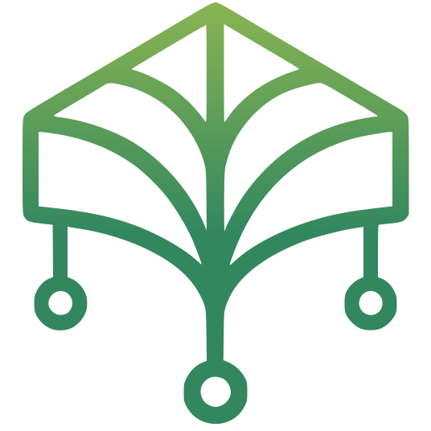

<p align="center">
  
</p>

<h1 align="center">Canopy</h1>

<p align="center">
  Cultivation compliance you can actually audit — seed-to-sale tracking, a<br>
  hash-chained audit trail, and per-state rules sourced from real regulation text.
</p>

<p align="center">
  <a href="https://github.com/hashking710/Canopy/actions/workflows/ci.yml"></a>
  <a href="LICENSE"></a>
  
</p>

<p align="center">
  <a href="https://canopy.hkdev.run">Website</a> ·
  <a href="https://cdemo.hkdev.run">Live demo</a> ·
  <a href="docs/screenshots.md">Screenshots</a> ·
  <a href="CONTRIBUTING.md">Contributing</a> ·
  <a href="https://ko-fi.com/hashking">Support on Ko-fi</a>
</p>

Runs on a Raspberry Pi per grow site and chains multiple sites up to a master
control panel. See [docs/architecture.md](docs/architecture.md) for the full
roadmap.

Phase 1 (mocked sensor data + dashboard UI) is done. Phase 2 (real sensor adapters —
23 plugins covering cloud, local-network, BLE, GPIO/I2C, and Modbus devices, plus
enterprise climate-computer integrations for Priva/Argus/Growlink) is largely built,
with per-adapter hardware verification the main thing still outstanding (see
[docs/plugin-development.md](docs/plugin-development.md#adapters-that-need-your-help)
for the handful still needing a real vendor account to finish); compliance/
track-and-trace tracking is built end-to-end, including a real (partial) METRC sync
plugin, not yet exercised against a live METRC account.
Phase 3 (MQTT chaining + master panel, including multi-site aggregation and
broker bridging for
intermittent-uplink sites) is done and verified with two real sites against a real
broker — see [docs/architecture.md](docs/architecture.md) for what's built vs. what
still needs real hardware or real METRC credentials to verify. A
production-hardening pass (migrations, retention, alerting, audit tamper-evidence,
Docker, dark mode, and more) is also done — see the "Hardening pass" section of
[docs/architecture.md](docs/architecture.md) for the full list. A cross-device relay
(multiple Pis at one site) is also built. Corporate-tier licensing is designed but
only its open-source interface exists so far (`GET /api/license/status` — always
reports everything unlocked until a separate closed-source package is installed) —
see [docs/licensing-design.md](docs/licensing-design.md).


Real data from Canopy's own [live demo](https://cdemo.hkdev.run) — see
[docs/screenshots.md](docs/screenshots.md) for a full tour of every page (facility,
room detail, compliance, harvests, lab results, alerts, and more).

## Get a Pi running in one command

Flash [Raspberry Pi OS Lite](https://www.raspberrypi.com/software/) with SSH
enabled, SSH in, then:

```bash
curl -fsSL https://raw.githubusercontent.com/hashking710/Canopy/main/deploy/install.sh | bash
```

Installs Docker if needed and brings the dashboard up — see
[docs/os-image.md](docs/os-image.md) for the full walkthrough, including a
zero-SSH first-boot option. To try it locally first instead of on real
hardware, see "Running with Docker" just below.

## Which setup do I need?

- **One Pi, one or two tents (most home growers)**: just `edge-agent` + `frontend`.
  You don't need Mosquitto or `master` at all — the dashboard talks directly to your
  one Pi.
- **Multiple Pis across several sites, one operator wanting a combined view (a "main
  brain")**: add `master` + a Mosquitto broker on top. Each site's edge agent
  publishes its room state over MQTT; `master` subscribes and mirrors all of them so
  `/master` in the dashboard can show every site in one place.

Nothing about a single Pi's setup changes if you later add `master` — it's purely
additive, and safe to skip entirely if you're not sure you need it yet.

If you're running on real Pi hardware and want the room-creation UI's "scan for
nearby devices" button to actually find local-network devices (Shelly today), use
`docker-compose.pi.yml` instead of the default file — see "Running on a Pi with
local-network device discovery" below. It's a separate opt-in file, not a flag,
because it trades away Docker's network isolation to make that scan possible.

## Running with Docker (fastest way to see the whole stack)

```bash
docker compose up --build
```

Brings up just the edge agent and the frontend — the single-Pi/single-tent case
above. Migrations and demo-data seeding run automatically on first boot.

- Dashboard: `http://localhost:5173`
- Edge agent API: `http://localhost:8000`

To also bring up Mosquitto and the master service (the multi-site case above):

```bash
docker compose --profile multi-site up --build
```

- Master API additionally available at `http://localhost:9100`

This is the whole point of the multi-site design in one box: the edge agent publishes
room state over MQTT, the master subscribes and mirrors it, and `/master` in the
dashboard shows the same data through the master's API instead of the edge agent's.
For iterating on code, running each service natively (below) is faster than rebuilding
images on every change.

### Running on a Pi with local-network device discovery

```bash
docker compose -f docker-compose.pi.yml up --build
```

By default `edge-agent` runs on Docker's own isolated network, same as any other
container — which means BLE device scanning works (it talks straight to Bluetooth
hardware), but mDNS scanning for local-network devices like Shelly can't see your
real LAN's traffic and always finds nothing. `docker-compose.pi.yml` runs `edge-agent`
with `network_mode: host` instead, giving it real access to your Pi's network so mDNS
scans actually work. This only behaves as real host networking on Linux, which is why
it's Pi-specific rather than the default everywhere. Everything else about it (ports,
`--profile multi-site`, volumes) matches the default file.

## Running locally

**Backend** (Python 3.11+):

```bash
cd edge-agent
python -m venv .venv
.venv/Scripts/activate   # or source .venv/bin/activate on macOS/Linux
pip install -e ".[dev]"
uvicorn canopy_agent.main:app --reload
```

Serves the API on `http://localhost:8000` (`/api/facility`, `/api/rooms`, `/ws/live`).
SQLite data lives in `edge-agent/data/canopy.db`. A real deployment starts on a
genuinely empty facility — no rooms, no plants, no demo compliance history — since
that's what actually ships. The dashboard walks you through setup on first load: a
form to create the facility, then a "+ add room" form per room (sensor adapter picked
from what's actually installed, with structured metric/adapter config fields — see
`docs/architecture.md`'s "Facility & room setup" section). To try the dashboard
already populated with realistic demo data (a two-bay greenhouse, propagation rooms,
post-harvest, etc. — all still using the mock sensor adapter, not real hardware)
instead, set `CANOPY_SEED_DEMO_DATA=true` before first boot.

Run tests with `pytest` from `edge-agent/`. Schema changes are tracked with Alembic
(`edge-agent/alembic/`) and applied automatically on startup — no manual migration step,
and existing data survives an upgrade instead of the DB needing to be wiped.

## Sensor adapter plugins

Device integrations beyond the built-in mock adapter ship as separate packages under
`plugins/` — see [docs/plugin-development.md](docs/plugin-development.md) to write your
own. To try the AC Infinity cloud/WiFi plugin instead of mock data:

```bash
pip install -e plugins/canopy-adapter-ac-infinity
```

(into the same venv as `edge-agent`), then set `CANOPY_AC_INFINITY_EMAIL` /
`CANOPY_AC_INFINITY_PASSWORD`, and set a room's `adapter_type` to `"ac_infinity_cloud"`
and `adapter_config` to `{"dev_id": "<controller devId>"}` in the database (no UI for
this yet). See `docs/architecture.md` for caveats — this adapter hasn't been verified
against a real account.

Also available:

- `plugins/canopy-adapter-modbus` — generic Modbus TCP/RTU, works with any
  Modbus-capable device via a device-described register map in `adapter_config`.
- `plugins/canopy-adapter-mqtt` — subscribes to arbitrary MQTT topics; makes any
  ESPHome/Tasmota/Zigbee2MQTT device usable with no vendor-specific code. Fully
  verified against a real broker, including live in this repo's own Docker stack.
- `plugins/canopy-adapter-shelly`, `canopy-adapter-ecowitt`,
  `canopy-adapter-switchbot`, `canopy-adapter-govee` — smart plugs (power
  monitoring), weather-station/soil gateways, and consumer temp/humidity sensors.
  Each verified against a real local server implementing that vendor's actual
  documented API shape; none exercised against a real account/device yet.
- `plugins/canopy-adapter-gpio` — direct-attached Pi sensors, 9 kinds behind one
  adapter: SHT31 (I2C temp/RH), DS18B20 (1-Wire temp), ADS1115 (I2C analog — PAR
  sensors, soil moisture, generic analog probes), digital GPIO (float
  switches/leak sensors), SGP30 and ENS160 (I2C VOC/AQI air quality), SCD4x (I2C true
  NDIR CO2 + temp/RH), HX711 (bit-banged load cell, for reservoir/nutrient weight),
  and BME280 (I2C temp/pressure/RH — the lowest-confidence code in this whole repo;
  see `docs/architecture.md`). Genuinely can't be verified without physical hardware;
  every piece of pure protocol math is unit-tested, and the digital-GPIO path is fully
  tested via `gpiozero`'s own mock pin backend.
- `plugins/canopy-adapter-atlas-ezo` — Atlas Scientific EZO pH/EC/DO/ORP/RTD probes
  for fertigation/reservoir water quality, over I2C. Same hardware-verification
  caveat as the GPIO adapter.
- `plugins/canopy-adapter-ble` — two adapter classes on top of `bleak`: `ble` (active
  GATT characteristic read) and `ble_advertisement` (passive broadcast scan, for
  coin-cell sensors that don't accept connections). Both configured generically
  (byte offset + format per field) rather than hardcoded to one vendor's byte layout.
- `plugins/canopy-adapter-aranet4` — BLE CO2/temp/pressure/humidity monitor via its
  community-documented custom characteristic. Implemented from recollection of the
  documented byte layout, not verified against a real device.
- `plugins/canopy-adapter-tuya` — the Tuya white-label ecosystem (many budget smart
  plugs/sensors under different storefront brands), via the real `tinytuya` library
  rather than a hand-rolled implementation of Tuya's AES-encrypted local protocol.
- `plugins/canopy-adapter-rachio`, `canopy-adapter-rainmachine` — irrigation
  controllers; report `zone_active` (1.0/0.0) rather than a continuous sensor value,
  for correlating watering runs against soil-moisture/EC/humidity spikes elsewhere.
  Rachio is a real cloud API (Bearer token); RainMachine is a real local HTTPS API
  (login → token → zone query). Both verified against a real local test server for
  the auth/request plumbing; exact zone-state semantics implemented from recollection.
- `plugins/canopy-adapter-trolmaster` — scaffolded only, not functional yet, blocked
  on vendor API access; see that package's docstring.

Not built: Emporia Vue (whole-panel power monitoring) — its cloud API needs AWS
Cognito SRP auth, judged too high-risk to implement correctly from memory without a
vetted library to lean on (unlike Tuya's AES, which has one). Cameras/vault security
were explicitly out of scope for this round.

See `docs/architecture.md`'s Phase 2 section for what's verified vs. not, per adapter.

**Frontend**:

```bash
cd frontend
npm install
npm run dev
```

Run tests with `npm test` (Vitest + React Testing Library). `.github/workflows/ci.yml`
runs the full suite — edge-agent, the AC Infinity plugin, master, and frontend — on
every push. (Currently blocked from actually running by a GitHub Actions billing lock
on the account, not a workflow or code problem — see `docs/architecture.md`.)

Serves the dashboard on `http://localhost:5173`, talking to the backend above. A
light/dark theme toggle sits in the top-right corner of every page (defaults to your OS
preference, persisted in `localStorage`).

Visit `/compliance` for the audit trail (SHA256 hash-chained — tamper-evident, with a
"chain intact" indicator and CSV export), waste-reporting deadlines, and plant-count
reconciliation — seeded with realistic demo data (including two demo operators) on
first run.


Compliance actions are attributed to a registered **operator** (picked from
a dropdown, optionally PIN-confirmed for plant destruction/waste — see
`docs/architecture.md`), not a free-text name. Deadlines, tagging triggers, and
plant-count limits for non-commercial (home/medical/caregiver) growers come from a
per-state ruleset covering 11 states, defaulting to `CA` (overridable via
`CANOPY_COMPLIANCE_STATE`, or set directly by an operator on the compliance page — an
audit-logged action, since it's a fact about the facility's actual legal jurisdiction,
not a display preference) — each fact is tagged `primary_source` / `secondary_source` /
`could_not_verify`, never presented as uniformly certain. See `GET /api/compliance/
state-rules`, the compliance page's footnote, and the "State-specific rules" section of
`docs/architecture.md` before relying on a given state. Visit `/alerts` to set
threshold rules per room+metric and see currently-breached alerts (optionally wired to
a webhook, email, or Discord — see `docs/architecture.md` and
[docs/discord-alerts.md](docs/discord-alerts.md)). Nothing syncs to METRC or any
state system by default — set `CANOPY_COMPLIANCE_SYNC=metrc` with
`plugins/canopy-compliancesync-metrc/` installed and real credentials to turn on a
real (partial — see `docs/architecture.md`) METRC sync.

## Chaining / master panel (optional)

To try the multi-site pipeline: an MQTT broker, one edge agent publishing to it, and
the master aggregator service.

**Broker** — for local dev only, there's no dependency on a real Mosquitto install:

```bash
pip install amqtt
amqtt   # listens on 0.0.0.0:1883 with default config
```

(A real deployment should use actual Mosquitto per site — see `docs/architecture.md`
and [docs/mqtt-security.md](docs/mqtt-security.md) for locking the broker down with
credentials/TLS instead of the anonymous-access dev default.)

**Edge agent**, with MQTT publishing turned on:

```bash
cd edge-agent
CANOPY_MQTT_HOST=localhost CANOPY_SITE_ID=site-1 uvicorn canopy_agent.main:app --port 8000
```

**Master service**:

```bash
cd master
python -m venv .venv
.venv/Scripts/activate
pip install -e ".[dev]"
CANOPY_MQTT_HOST=localhost uvicorn canopy_master.main:app --port 9100
```

Serves `http://localhost:9100` (`/api/sites`, `/api/sites/{site_id}/rooms`, `/ws/live`).
Run tests with `pytest` from `master/`. Visit `http://localhost:5173/master` in the
already-running frontend to see it.

**Windows only**: both services need `--loop none` appended to the `uvicorn` command
above (e.g. `uvicorn canopy_agent.main:app --port 8000 --loop none`) — see
`docs/architecture.md` for why. Not needed on Linux/the Pi target.

## Auth (optional)

Off by default — everything above works with zero configuration. To lock a deployment
down, set `CANOPY_API_TOKEN` on the edge agent and/or `CANOPY_MASTER_TOKEN` on the
master service (separate secrets — one doesn't grant the other), then set matching
`VITE_API_TOKEN` / `VITE_MASTER_API_TOKEN` when running/building the frontend. This is
shared-secret auth for a single-operator local-network appliance, not user accounts —
see `docs/architecture.md` for why, and for what a real multi-user login would take.

## TLS (optional)

Also off by default. See [docs/deployment-tls.md](docs/deployment-tls.md) — a
self-signed cert for LAN-only setups (`scripts/generate-self-signed-cert.sh`), or a
reverse proxy with a real certificate for anything reachable beyond your LAN.

## Documentation

- [docs/architecture.md](docs/architecture.md) — the full roadmap: what's built,
  what's in progress, and what's explicitly not started, phase by phase.
- [docs/os-image.md](docs/os-image.md) — getting Canopy onto a Raspberry Pi with
  one command, plus a zero-SSH first-boot option.
- [docs/screenshots.md](docs/screenshots.md) — a full visual tour of every page in
  the dashboard, from Canopy's own live demo.
- [docs/plugin-development.md](docs/plugin-development.md) — the sensor-adapter
  contract, for writing support for hardware not already covered.
- [docs/licensing-design.md](docs/licensing-design.md) — how the free/corporate
  tier split is designed to work once the closed-source gating package exists.
- [docs/deployment-tls.md](docs/deployment-tls.md) — TLS setup, self-signed or
  behind a reverse proxy.
- [docs/mqtt-security.md](docs/mqtt-security.md) — locking down the MQTT broker
  (credentials + optional TLS) for a real multi-site deployment.
- [docs/discord-alerts.md](docs/discord-alerts.md) — wiring alert notifications to
  a Discord webhook.
- [CONTRIBUTING.md](CONTRIBUTING.md) — how to submit a change, plus a punch list of
  adapters that need a real vendor account to finish.

## License

MIT — see [LICENSE](LICENSE). Covers this repo (edge agent, frontend, master,
and every first-party plugin under `plugins/`) end to end; nothing here is
gated. The corporate tier's gating package (`canopy-license`) is a separate,
closed-source repo — see [docs/licensing-design.md](docs/licensing-design.md)
for why that split doesn't make this any less real open source.
