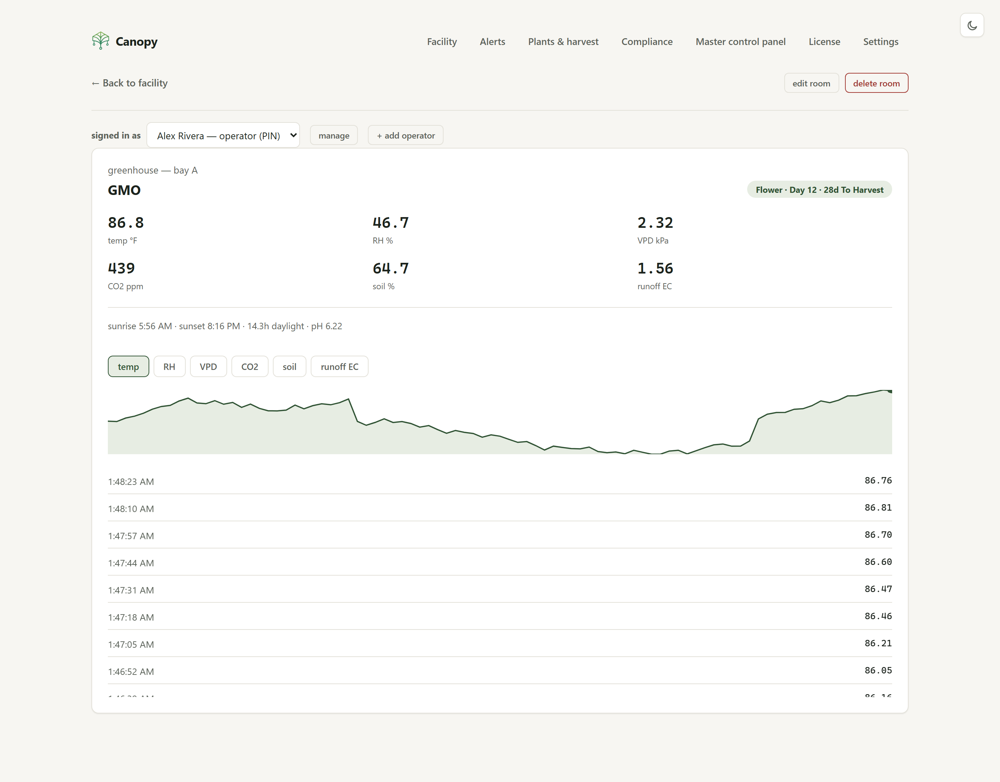
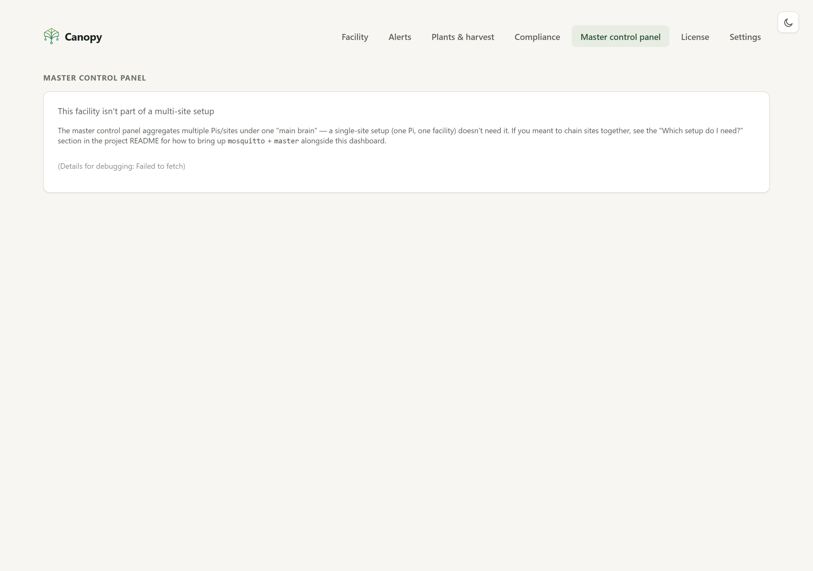
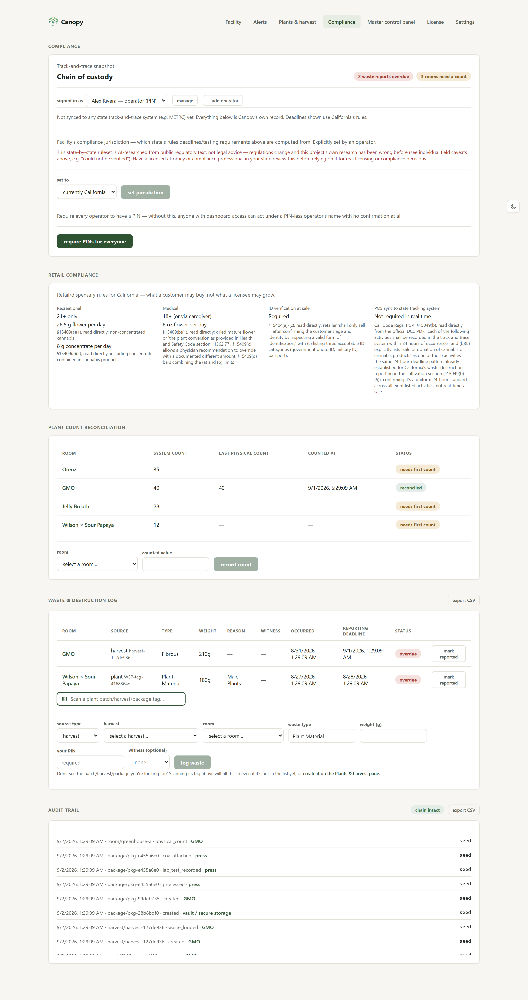

# Canopy — architecture & roadmap

## Facility & room setup (built)

Demo seeding (`seed.py`/`seed_compliance.py`) is opt-in only
(`CANOPY_SEED_DEMO_DATA=true`) — a real deployment starts on a genuinely empty
facility, no fake rooms or compliance history. Getting from that empty state to a
real, working facility is a real, tested flow, not a manual DB-editing workaround:

- **`POST /api/facility`** — one-time, creates the singleton facility row (fixed
  `id="facility"`, not user-supplied — `GET /api/facility` looks it up by that exact
  id). Rejects a second call once one exists. Frontend: `OnboardingWizard`
  (`frontend/src/components/OnboardingWizard.tsx`), shown automatically by
  `FacilityOverview` in place of the dashboard whenever `GET /api/facility` 404s —
  a real guided first-run flow (facility → register yourself as an operator → set
  your compliance jurisdiction → add your first room), replacing an earlier version
  that was just a bare single-field facility-name form with no further guidance.
  Every step past facility creation is skippable/deferrable and reuses the same
  already-built, already-role-gated forms the rest of the app uses (`OperatorPicker`,
  the Compliance page's jurisdiction picker, `AddRoomForm`) — this component only
  sequences them, it doesn't reimplement any of their logic or gating.
- **`POST /api/rooms`**, **`PUT /api/rooms/{id}`**, **`DELETE /api/rooms/{id}`** —
  full room CRUD. Validates the room id against a safe slug pattern, that
  `metric_config` entries have a `label` (and, specifically for the mock adapter,
  `min`/`max` — it needs a range to walk within; a real adapter reads the value from
  hardware and doesn't), and that `adapter_type` is actually installed
  (`GET /api/rooms/adapters/available` lists what's real on this device, sourced from
  `adapters/registry.py` — not a hardcoded guess). Deleting a room also cleans up its
  `Reading`/`ReadingRollup`/`AlertRule`/`AlertEvent` rows, since SQLite doesn't
  enforce foreign keys here (see `db.py`) and they'd otherwise linger as orphans.
  Frontend: `AddRoomForm`, plus a delete action on `RoomDetail`. Metric config
  (`MetricConfigEditor`) and adapter config (`AdapterConfigEditor`) are both real
  structured field editors, not raw JSON textareas — `AdapterConfigEditor` renders
  one input per key straight from the adapter's own `config_schema`
  (`GET /api/rooms/adapters/available`), so there's nothing to hand-write for values
  the form already knows the shape of.
- Verified live end-to-end, not just via the test suite: created a real facility and
  room through the actual browser UI against a running Docker deployment, confirmed
  the room's live sensor readings actually populate a poll cycle later, and confirmed
  a `metric_config` missing `min`/`max` under the mock adapter is now rejected at
  creation time with a clear message — previously this surfaced as a bare
  `KeyError: 'min'` buried in `Room.last_poll_error`, a real bug this work exposed and
  fixed in `adapters/mock.py` alongside the new validation.
- **Not built**: editing/reordering sections, and anything resembling a guided setup
  wizard beyond the two forms described above.

## Phase 1 — single-Pi MVP (built)

- `edge-agent/` — Python + FastAPI service. SQLite (via SQLAlchemy) stores `Room` and
  `Reading` rows. A `MockAdapter` implementing `SensorAdapter` (`adapters/base.py`)
  random-walks values within per-room, per-metric ranges defined in `seed.py`. A
  background poller (`services/poller.py`) reads from the adapter every 5s, persists
  readings, computes derived metrics (VPD, via `services/vpd.py`), and broadcasts the
  update over `/ws/live` to connected dashboards.
- `frontend/` — React + Vite SPA. One reusable card component (`EntityCard`, built from
  `TerminalWindow` + `Badge` + `StatGrid`) renders every room type, since the mockups use
  one consistent visual pattern throughout. `FacilityOverview` groups rooms into the
  sections shown in the mockups; `RoomDetail` adds a metric picker + sparkline + history
  list over `/api/rooms/{id}/readings`.
- No networking between devices yet — this phase proves the data model and UI on a
  single machine.

## Phase 2 — real sensor integration (in progress)

`SensorAdapter` implementations plug in without touching the poller, storage, or API —
that boundary is why the interface exists. Rooms select their adapter via
`Room.adapter_type` + `Room.adapter_config` (default `"mock"`, unchanged from Phase 1).

**Plugin architecture (built)**: adapters beyond the built-in `MockAdapter` are no
longer part of this codebase — they're separate, independently versioned pip packages
discovered via Python's standard entry-points mechanism (`adapters/registry.py`, group
`canopy.sensor_adapters`), the same approach pytest/Flask/Home Assistant use for their
plugin ecosystems. This exists specifically because the long-term device list is
unbounded and we don't want to be the ones maintaining every integration: anyone can
ship a `canopy-adapter-*` package without touching this repo. See
[docs/plugin-development.md](plugin-development.md) for the full guide. Two things the
core provides so a third party's bug stays theirs:

- **Load isolation** — a plugin that fails to import, or isn't actually a
  `SensorAdapter`, or collides with an existing `adapter_type` name, is logged and
  skipped at startup rather than crashing the app (`registry._register_plugin`).
- **A read timeout** (`ADAPTER_READ_TIMEOUT_SECONDS = 10` in `services/poller.py`) — a
  hung adapter (bad network call, deadlocked driver) can't stall every other room's
  poll cycle indefinitely, on top of the existing per-room try/except isolation.

Applied the same way to compliance sync targets (`compliance_sync/registry.py`, group
`canopy.compliance_sync`) for consistency — a METRC/BioTrack/etc. integration is the
same "many possible, don't want to maintain them all" situation as sensor adapters.

- **AC Infinity — cloud/WiFi (`ac_infinity_cloud`, built, now a plugin)**: moved from
  `edge-agent/canopy_agent/adapters/` to `plugins/canopy-adapter-ac-infinity/` as the
  reference implementation of the plugin shape above — install it with
  `pip install -e plugins/canopy-adapter-ac-infinity` into the edge-agent's venv. For
  WiFi-connected UIS controllers (Controller 69 WiFi/Pro/Pro+, AI+). AC Infinity has no
  public API; the endpoints, auth flow, and field scaling are reverse-engineered,
  sourced from the maintained open-source Home Assistant integration
  ([dalinicus/homeassistant-acinfinity](https://github.com/dalinicus/homeassistant-acinfinity)),
  not from official docs or a device tested against directly. **Needs verification
  against a real AC Infinity account before relying on it** — set
  `CANOPY_AC_INFINITY_EMAIL` / `CANOPY_AC_INFINITY_PASSWORD` and a room's
  `adapter_config.dev_id`, then confirm the readings it reports match the AC Infinity
  app.
- **AC Infinity — Bluetooth-only controllers (`ac_infinity_ble`, built)**:
  `plugins/canopy-adapter-ac-infinity-ble/`, for Controller 67/69 Pro and similar UIS
  controllers that never sync to AC Infinity's cloud, so the adapter above can't reach
  them. Confidence note, stronger than most in this ecosystem: rather than
  reconstructing the protocol from a forum thread's hex payloads or from memory, the
  byte layout is a direct, byte-for-byte port of a real MIT-licensed library's actual
  source — [hunterjm/ac-infinity-ble](https://github.com/hunterjm/ac-infinity-ble)
  (PyPI: `ac-infinity-ble`) — fetched and read directly. The temperature-is-Celsius
  and VPD-is-kPa interpretations are further corroborated against that same author's
  separate, real Home Assistant integration
  ([hunterjm/ac-infinity-hacs](https://github.com/hunterjm/ac-infinity-hacs)), whose
  `sensor.py` declares `UnitOfTemperature.CELSIUS` for the same raw value with no
  conversion — two independent, real pieces of software agreeing on what the bytes
  mean. Passive only, by design: every value comes from the BLE advertisement's
  manufacturer-specific data (company ID 2306), the same "no active connection"
  advertising path `canopy-adapter-ble`'s `BleAdvertisementAdapter` already uses —
  this adapter never connects to or writes anything to the controller, so there's no
  risk of it changing a fan's speed or mode (setting fan speed was out of scope
  regardless — `SensorAdapter` is read-only by design, see `adapters/base.py`).
  `hunterjm/ac-infinity-ble`'s own README describes itself as "Pre-Alpha", so real
  hardware verification is still warranted before trusting production values.
- **Direct-attached Pi sensors — GPIO/I2C/1-Wire (`gpio`, built)**:
  `plugins/canopy-adapter-gpio/`, now 9 sensor "kinds" behind one adapter, each
  described by `room.adapter_config` rather than hardcoded: `sht31` (I2C temp/RH),
  `ds18b20` (1-Wire temp, via the Linux kernel's own w1-therm driver — no custom
  protocol code needed at all), `ads1115_analog` (I2C analog-to-digital — the generic
  path for anything with an analog voltage output: PAR/PPFD light sensors, capacitive
  soil moisture, analog EC/pH transmitters), `gpio_digital` (float switches / binary
  leak sensors), `sgp30` (I2C VOC/eCO2 air quality), `ens160` (I2C AQI/TVOC/eCO2 air
  quality, register-addressed rather than SGP30's raw-command style — and
  little-endian where SGP30/SHT31 are big-endian, a real gotcha flagged inline and
  guarded by a dedicated test), `scd4x` (I2C true NDIR CO2 + temp/RH — stateful: needs
  a one-time "start periodic measurement" command on first use per bus/address, and
  the first read intentionally raises rather than fabricate a value before the sensor
  has one ready; also divides by 65536 not SHT31's 65535, another easy copy-paste trap
  guarded by its own test), `hx711` (bit-banged 2-pin load-cell amplifier — 24-pulse
  MSB-first two's-complement read plus a 25th gain-set pulse, via `gpiozero`), and
  `bme280` (I2C temp/pressure/RH — the single lowest-confidence piece of code in the
  whole adapter ecosystem: Bosch's real double-precision reference compensation
  algorithm, calibration coefficients read once per chip and cached, implemented from
  memory rather than verified against a real worked example — tests cover what can
  actually be proven without trusting a specific numeric answer: monotonicity,
  division-by-zero guards, humidity clamping, and the documented dig_H4/dig_H5
  nibble-packing quirk). **Genuinely cannot be verified end-to-end without physical
  hardware on a real Pi** — what *is* real: every piece of pure protocol math (SHT31's
  and SGP30's/SCD4x's shared Sensirion CRC8, checked against Sensirion's own published
  test vector; ADS1115's register bit-layout; DS18B20's sysfs text parsing; HX711's
  bit-decode) is unit-tested without a bus, and the digital-GPIO path is fully
  hardware-verified via `gpiozero`'s own official mock pin backend — which is how a
  real bug got caught before shipping: an early version's manual active-high/active-low
  inversion double-counted gpiozero's own `pull_up`-relative polarity semantics,
  silently inverting every active-low sensor reading. Also fixed along the way: this
  package imports `smbus2`, which imports the POSIX-only stdlib `fcntl` at its own
  top level — importing that anywhere at *this* package's top level would have broken
  installing/testing it on non-Linux dev machines entirely; deferred to inside the
  methods that actually touch a real I2C bus instead.
- **BLE sensors — active GATT read + passive advertisement scan (`ble` /
  `ble_advertisement`, built)**: `plugins/canopy-adapter-ble/`, on top of the real
  cross-platform `bleak` library (confirmed importable on Windows with no BT hardware
  present — it only touches the OS Bluetooth stack at scan/connect time). Two adapter
  classes cover BLE's two real device models: `ble` connects and reads a GATT
  characteristic (for devices that accept connections), `ble_advertisement` passively
  scans broadcast advertisement payloads (for coin-cell devices — e.g. re-flashed
  Xiaomi Mijia sensors — that broadcast instead of accepting connections to save
  power). Both are configured generically (byte offset + format per field), the same
  "device describes its own shape" philosophy as Modbus's register map, rather than
  hardcoding one vendor's byte layout — deliberately, since re-flashed BLE sensors in
  the wild genuinely disagree on layout (ATC1441 vs. pvvx firmware variants), and
  guessing one specific variant risked being confidently wrong. Pure decode logic is
  unit-tested (SIG environmental-sensing temperature characteristic, all supported
  numeric formats, scale/offset/°C→°F conversion); the actual over-the-air read/scan
  has not been exercised against a real BLE device.
- **Aranet4 — BLE CO2 monitor (`aranet4`, built)**: `plugins/canopy-adapter-aranet4/`.
  A real, popular NDIR CO2/temp/pressure/humidity sensor with a community-documented
  custom BLE characteristic (`f0cd3001-...`, packed little-endian struct). Implemented
  from recollection of the documented byte layout, not verified against a real device
  or the `aranet4` PyPI project's own source — the lowest-confidence BLE adapter here,
  flagged as such in its docstring; pure decode logic is unit-tested against
  self-constructed byte layouts.
- **Fertigation/reservoir water quality — Atlas Scientific EZO (`atlas_ezo`, built)**:
  `plugins/canopy-adapter-atlas-ezo/`. pH, EC (conductivity), dissolved oxygen, ORP,
  and RTD temperature probes, over I2C — real quality monitoring for nutrient
  solution, not just climate. A real, simple, well-documented ASCII command/response
  protocol (write a command string, wait a processing delay, read back a status byte
  + result string) — not reverse-engineered. Same honesty caveat as the GPIO adapter:
  the response-parsing logic is unit-tested, the I2C transaction itself is not
  verified against real hardware.
- **Consumer smart-home sensors — MQTT/Shelly/Ecowitt/SwitchBot/Govee (all built)**:
  - **`mqtt` (`plugins/canopy-adapter-mqtt/`)** — subscribes to arbitrary MQTT topics,
    the one adapter that makes every ESPHome, Tasmota, and Zigbee2MQTT device (in
    practice, most of the Home Assistant sensor ecosystem) usable with zero
    vendor-specific code. Push-based under the hood (a shared background subscriber
    per broker caches the latest value per topic; `read()` itself never does network
    I/O) — **fully verified for real**, including against the actual live Mosquitto
    broker this stack already runs: a room configured with this adapter, in the real
    running Docker container, correctly picked up a genuinely published MQTT value
    through the complete pipeline (poller → adapter → DB → API). A real gap was found
    and fixed along the way: a newly-added room's topic only got subscribed *between*
    incoming messages, so on a quiet broker it could stall indefinitely — fixed with a
    1s polling check instead of relying on message arrival.
  - **`shelly` (`plugins/canopy-adapter-shelly/`)** — Shelly smart plug/relay power
    monitoring, Gen1 and Gen2/3, purely local (no cloud account). Shelly's local HTTP
    API is genuinely public and documented, unlike AC Infinity's. Verified against a
    real local HTTP server implementing both generations' documented response shapes.
  - **`ecowitt` (`plugins/canopy-adapter-ecowitt/`)** — Ecowitt weather-station/soil
    gateways, local LAN API. Verified against a real local HTTP server matching the
    documented `get_livedata_info` response shape; the exact `id` codes a real
    gateway reports should still be double-checked against firmware, which has been
    known to drift slightly.
  - **`switchbot` (`plugins/canopy-adapter-switchbot/`)** — Meter/MeterPlus/Hub2
    temp+humidity sensors via SwitchBot's real, official, versioned public cloud API
    (unlike AC Infinity's reverse-engineered one). HMAC-SHA256 request signing
    verified against an independently-recomputed signature, and the full
    request/response round trip verified against a real local server.
  - **`govee` (`plugins/canopy-adapter-govee/`)** — H5xxx-series temp+humidity
    sensors via Govee's official Developer API (a simple API-key header, no HMAC).
    Same real-local-server verification approach as SwitchBot.
  - All four cloud/local adapters above share one honest caveat: implemented straight
    from each vendor's own published API documentation, but none has been exercised
    against a real account or a real physical device — a real API response would be
    the strongest remaining confirmation.
- **Tuya ecosystem — generic (`tuya`, built)**: `plugins/canopy-adapter-tuya/`. Tuya
  white-labels an enormous range of budget smart plugs/sensors sold under many
  storefront brand names, all speaking the same local protocol (custom binary framing
  + AES encryption). Deliberately *not* hand-rolled from memory — a framing/crypto bug
  can silently produce plausible-looking garbage rather than an obviously-wrong
  number, a meaningfully worse failure mode than a wrong scale factor — so this
  adapter depends on the real, mature `tinytuya` PyPI package instead, the same
  "use a real library for a real protocol" principle already applied to
  `pymodbus`/`bleak`/`smbus2`. `tinytuya`'s actual `Device`/`.status()`/`.set_version()`
  signatures were confirmed via `inspect.signature()` against the installed package
  before writing code against them, not assumed from memory. `room.adapter_config`
  maps Tuya's numbered "DPs" (data points) to metric names — another instance of the
  "device describes its own shape" pattern. Not exercised against a real Tuya device
  or account.
- **Irrigation controllers — Rachio + RainMachine (built)**: report a boolean-ish
  `zone_active` (1.0/0.0) rather than a continuous sensor value, since these are
  scheduling/control APIs correlating irrigation/fertigation runs against
  soil-moisture/EC/humidity spikes from other adapters, not sensor-reporting APIs —
  documented as a genuinely different kind of "reading" than everything else in this
  ecosystem.
  - **`rachio` (`plugins/canopy-adapter-rachio/`)** — Rachio's real public cloud API
    (`api.rach.io`), Bearer-token auth via `CANOPY_RACHIO_API_KEY`. Verified against a
    real local test server proving the auth header and both the "active schedule" and
    HTTP-204-idle response paths.
  - **`rainmachine` (`plugins/canopy-adapter-rainmachine/`)** — RainMachine's local
    HTTPS API (device on-LAN, self-signed cert, no cloud round-trip, matching how the
    well-known Home Assistant integration for it works): a two-step
    login-for-token-then-query-zones flow, `CANOPY_RAINMACHINE_PASSWORD`, token cached
    per host across reads. Verified against a real local test server proving the full
    login→token→zone-query round trip, token caching across repeated reads, and
    login-failure error handling.
  - Both adapters' real protocol shape (auth flow, request/response plumbing) is
    verified against a real local server; the exact zone-state value semantics are
    implemented from recollection, not verified against a real device.
- **Emporia Vue — whole-panel power monitoring (`emporia_vue`, built)**:
  `plugins/canopy-adapter-emporia-vue/`. Was originally skipped because its cloud API
  authenticates via AWS Cognito SRP (Secure Remote Password) — a genuinely complex
  challenge-response protocol, too risky to hand-roll from memory — with the noted
  path forward being to add it once a maintained Python SRP/Cognito client was
  vetted. Built on exactly that: [`pycognito`](https://pypi.org/project/pycognito/)
  (PyPI, MIT licensed, depends on `boto3`/`pyjwt`) does the actual SRP handshake;
  this adapter hand-rolls the rest of the HTTP calls with `aiohttp` itself, the same
  "depend on a vetted library only for the genuinely hard cryptographic part" shape
  as `canopy-adapter-tuya`'s `tinytuya` dependency for AES. The Cognito user/client
  pool IDs, the `AppAPI?apiMethod=getDeviceListUsages` endpoint shape, and the
  kWh-at-1-second-scale→watts conversion (`usage * 3600 * 1000`) were taken directly
  from reading [`magico13/PyEmVue`](https://github.com/magico13/PyEmVue)'s real
  source (PyPI: `pyemvue`, v0.18.9, MIT licensed) rather than reconstructed from
  memory, and that watts conversion is independently corroborated by a second,
  unrelated project (mcsMQTT, a HomeSeer plugin) using the same formula. Credentials
  (`CANOPY_EMPORIA_EMAIL`/`CANOPY_EMPORIA_PASSWORD`) follow the same hot-reload
  pattern as every other cloud adapter — read fresh in `read()`, with a
  `_logged_in_with` tuple forcing a real re-login when they change, same as
  `canopy-adapter-ac-infinity`. Not yet verified against a real Emporia Vue account
  or device — the request/response plumbing (headers, params, retry-once-on-401) is
  tested against a real local HTTP server, but the actual auth handshake and value
  semantics carry the same "needs a real account to fully trust" caveat as every
  other from-source-not-from-hardware adapter here.
- **Six more vendor adapters, from a deep hardware-API research pass (built)**: found
  by researching which cultivation-relevant hardware vendors have a real, usable
  integration path beyond what was already covered — sourced from each vendor's own
  live documentation (fetched directly, not recalled), not guessed at.
  - **`meter_zentra` (`plugins/canopy-adapter-meter-zentra/`)** — METER Group ZENTRA
    Cloud (TEROS/ATMOS/PHYTOS soil/substrate/weather sensors). Base URL, `X-API-Key`
    auth header, and the `GET /devices/{id}/data` endpoint are confirmed directly
    against ZENTRA's own v5 API docs; the exact response envelope isn't (their own
    overview doc defers that to a separate reference article this project's fetch
    tooling couldn't reach) — `read()` makes the real authenticated request but
    parses the response defensively, raising a diagnostic error naming the actual
    top-level keys found rather than guessing a shape and returning silently wrong
    values.
  - **`hobolink` (`plugins/canopy-adapter-hobolink/`)** — Onset HOBOlink Web
    Services V3. Real OAuth2 client-credentials flow and the `/data/file/JSON/
    user/{userId}` export endpoint, both confirmed against Onset's own published
    Developer's Guide. Same defensive-response-parsing posture as ZENTRA above for
    the parts not independently confirmed.
  - **`priva` (`plugins/canopy-adapter-priva/`)** — Priva Realtime Data API
    (enterprise greenhouse climate computers). The OAuth2/OIDC token exchange
    (`auth.priva.com/connect/token`) is real and implemented; the actual telemetry-
    read endpoint isn't — Priva's API is provisioned per-customer (a fixed base URL
    can't even be hardcoded) and its reference docs are behind an account login.
    `read()` runs the real token acquisition, then raises `NotImplementedError`
    naming exactly what a real account would be needed to confirm. Tracked in
    [issue #4](https://github.com/hashking710/Canopy/issues/4) — if you have a Priva
    account with the Realtime Data API add-on, that's the fastest path to finishing
    this one.
  - **`growlink`, `argus`, `pulsegrow`** — scaffolds, same posture as the
    pre-existing `trolmaster` adapter: real vendor infrastructure confirmed to exist
    (Growlink's cannabis-specific Azure-APIM-backed developer portal; Argus
    Controls' GET-only, username/password-gated Titan API, confirmed via their own
    official datasheet; Pulse Grow's live `api.pulsegrow.com` API with in-app-issued
    keys) but no publicly reachable endpoint reference for any of the three — each
    `read()` raises `NotImplementedError` with a specific, sourced explanation of
    what's blocking it, never a guessed request shape presented as working. Each has
    its own tracking issue asking for help from anyone with a real vendor account:
    [Growlink (#1)](https://github.com/hashking710/Canopy/issues/1),
    [Argus (#2)](https://github.com/hashking710/Canopy/issues/2),
    [Pulse Grow (#3)](https://github.com/hashking710/Canopy/issues/3).
  - Corrections from this same research pass: the pre-existing `trolmaster` and
    `ac_infinity` adapters' approaches were independently re-verified and found
    still accurate — no changes needed. Fluence/Signify GrowWise-brand lighting
    controllers were researched and found to already be covered by the generic
    `modbus` adapter (they document Modbus/the open Horticulture Lighting Protocol
    for third-party integration) rather than needing a dedicated plugin.
- **Modbus TCP/RTU — generic (`modbus`, built)**:
  `plugins/canopy-adapter-modbus/`. Came out of hardware-landscape research into what
  commercial cultivation facilities actually run (Trolmaster, Argus, Priva, Growlink,
  industrial I/O gateways) — several enterprise-tier controllers have an
  enterprise-gated or undocumented cloud API but still expose a plain Modbus interface,
  since it's an open, standardized protocol rather than a vendor secret. Unlike AC
  Infinity, Modbus itself carries no self-describing metadata — a register is just a
  number; what it means is entirely device-specific — so this adapter can't ship a
  fixed metric list. Each room's `adapter_config` instead describes that device's own
  register map (address, `holding`/`input` register type, `int16`/`uint16`/`int32`/
  `uint32`/`float32` data type, `word_order` for 32-bit values — real devices genuinely
  disagree on this — plus a `scale`/`offset`). One shared connection per unique
  `(transport, host, port)` (or serial port) target, cached across every room using it,
  matching the AC Infinity plugin's "one shared session" pattern. Verified against a
  real (locally simulated) Modbus TCP server via `pymodbus`'s own server implementation
  — genuine wire-protocol I/O, not a mock — covering int16/uint16/int32/uint32/float32
  decoding (including negative two's-complement and both word orders) and connection
  sharing; still needs verification against real hardware.
- **TrolMaster cloud API (`trolmaster_cloud`, scaffolded, not functional)**:
  `plugins/canopy-adapter-trolmaster/`. Hardware research ranked TrolMaster
  (Hydro-X/Aqua-X/Carbon-X) as the best next single-vendor plugin target — real
  commercial-tier market presence, and an official vendor API Gateway program rather
  than a protocol needing reverse-engineering. But that program is signup/paid-gated
  ($15/device/month) and a direct fetch of its documentation 403'd — unlike AC
  Infinity, there was no concrete, verified endpoint shape to build against, so this
  package registers as a real plugin (proving the mechanism) but its `read()` raises
  `NotImplementedError` with what's needed to finish it, rather than shipping guessed
  request/response shapes as if they were verified.
- **Multiple adapters per room (built)** — a room's primary `adapter_type`/
  `adapter_config` is unchanged, but a room can now also have any number of
  `RoomAdapter` rows (`POST`/`DELETE /api/rooms/{id}/adapters`), e.g. a BLE
  controller for temp/RH plus a separate CO2 probe on the same room.
  `services/poller.py` reads the primary adapter, then each extra adapter in
  insertion order, merging every result into one dict per room — a later adapter's
  key wins on collision, so config order is a meaningful choice. Every existing
  `SensorAdapter.read(room)` implementation across every plugin package needed zero
  changes: an extra adapter is read by handing it a lightweight stand-in `Room` with
  that adapter's own type/config substituted in, never added to a DB session.
  Verified via `tests/test_poller_multi_adapter.py` (merge behavior, collision
  ordering, and that a room with no extra adapters is completely unaffected) and
  `tests/test_rooms_extra_adapters.py` (the CRUD endpoints, including that deleting
  a room cleans up its extra adapters — SQLite doesn't enforce foreign keys here,
  same reasoning as every other related-row cleanup in `routers/rooms.py`).
- **Ease-of-use pass on room setup (built)** — a real audit of the add-room flow
  found several genuine friction points for a non-technical user (credentials were
  the only severe gap; several others turned out already reasonably handled, e.g.
  `EnvVarNotice` already surfaced required env vars before this pass). What changed:
  - `SensorAdapter.default_metric_config` — a new optional class attribute, set on
    every adapter with a fixed, predictable reading shape (Govee, SwitchBot,
    AC Infinity, Aranet4, Rachio, RainMachine, Shelly's `power_w`). The room-creation
    UI now pre-fills the metric editor from it the moment an adapter is picked,
    instead of making the user retype exact key names (`temp_f`, `rh_pct`, ...) from
    the adapter's own docstring. Left empty (no change in behavior) for adapters
    that are inherently user-defined — Modbus registers, MQTT topics, BLE byte
    layouts, GPIO's per-kind sensors — since there's nothing to sensibly default
    there. Exposed via `GET /api/rooms/adapters/available`.
  - `SensorAdapter.category` — a new optional class attribute (`cloud` / `local` /
    `bluetooth` / `hardware` / `testing`) grouping the adapter picker into
    `<optgroup>`s instead of one flat list of 17 similarly-terse names — someone
    with a Govee sensor goes straight to "Cloud account" instead of scanning
    everything alphabetically.
  - `EntityCard`'s "sensor offline" indicator now shows the actual `last_poll_error`
    text inline (e.g. "govee adapter requires CANOPY_GOVEE_API_KEY to be set"), not
    only as a `title` hover tooltip — invisible on touch devices, and this is
    exactly the message a non-technical user needs to actually see to fix it.
  - **Deliberately not built in this pass** — flagged as real gaps at the time, both
    since closed (see "In-app credentials + BLE device discovery" below): (1)
    cloud-adapter credentials were env-var-only, read once at process start — fixed.
    (2) No device discovery — fixed for BLE, explicitly not attempted for
    local-network devices; see below for why. (3) `room_type` stayed a
    freetext-with-datalist field rather than a strict dropdown — converting it would
    break legitimate custom room types (`dry_cure`, `vault`, `press`, ...) that don't
    feed the plant-count tally; the existing inline warning about the three
    tally-relevant values (`greenhouse`/`clone_room`/`mother_room`) was judged
    adequate. Still not built.

- **In-app credentials + BLE device discovery (built)** — closes the two real gaps
  flagged in the ease-of-use pass above.
  - **Hot-reloadable credentials**: a new `FacilitySecret` table (`models.py`) is a
    minimal DB-backed key/value store — deliberately plaintext, matching the existing
    `.env`-file threat model rather than adding encryption-at-rest for a threat model
    that doesn't otherwise call for it. `GET/PUT/DELETE /api/secrets`
    (`routers/secrets.py`) lists, sets, and clears credentials; the settable-key list
    is aggregated live from every *installed* adapter's/compliance-sync plugin's
    `required_env_vars` (`available_adapter_types()` /
    `compliance_sync.registry.available_sync_types()`) — nothing hardcoded, so it's
    always accurate to what's actually installed. Write-only by design: `GET`
    reports only `is_set`/`set_via_dashboard`, never the value itself. On startup,
    `services/secrets_bootstrap.py` replays every stored row into `os.environ`
    before any adapter is constructed — a DB-set value wins over whatever
    `docker-compose.yml`/`.env` already put there.
    Five cloud adapters (Govee, SwitchBot, AC Infinity, Rachio, RainMachine) had
    their credential reads moved from `__init__` (cached once per process, since
    `adapters/registry.py` caches one adapter instance per `adapter_type` for the
    process's entire lifetime) into `read()` (evaluated fresh every poll cycle) —
    the mechanism that makes a dashboard-set credential take effect on the very next
    poll, no restart needed. Tuya needed no change: its credentials are entirely
    per-room `adapter_config`, already read fresh. AC Infinity and RainMachine each
    cache an authenticated session/token, which would otherwise keep working under a
    now-stale credential until it happened to fail — both track which credential
    value their cached session was established with and force a real re-login when
    it no longer matches. Surfaced in the dashboard at `Settings` →
    "Sensor & sync credentials".
  - **BLE device discovery**: `SensorAdapter.discover()` (`adapters/base.py`) is an
    optional classmethod, gated by a `supports_discovery` class flag so calling code
    never needs an `isinstance`/`hasattr` check to find out an adapter doesn't
    implement it. `POST /api/rooms/adapters/{adapter_type}/discover`
    (`routers/rooms.py`) calls it. Implemented for `ble`/`ble_advertisement`
    (`canopy-adapter-ble`, a passive `BleakScanner.discover()` scan, address + name +
    RSSI) and `aranet4` (`canopy-adapter-aranet4`, the same scan filtered to devices
    whose advertised name starts with "Aranet" — narrows a noisy roomful of BLE
    traffic down to the one device type this adapter actually talks to). The
    room-creation UI's new `DeviceDiscoveryPanel` shows a "scan for nearby devices"
    button for any adapter with `supports_discovery = true`; picking a result fills
    `adapter_config.address` directly — no external BLE scanner app needed first.
  - **Local-network discovery (mDNS/SSDP for Shelly, Ecowitt, and similar) was not
    built as part of the default deployment**, not silently skipped: `docker inspect`
    against a running edge-agent container confirmed it sits on Docker's own isolated
    bridge subnet (e.g. `192.168.16.0/24`), completely separate from the host's real
    LAN. mDNS/SSDP discovery depends on receiving broadcast/multicast traffic from the
    real LAN, which never reaches a bridge-networked container — a scan there always
    returns zero results, not an error, so it would be easy to ship something that
    silently never works. BLE discovery has no such problem: it works through the same
    direct hardware Bluetooth adapter access the `ble` and `aranet4` adapters' own
    `read()` already require via `bleak` — a connection to a local Bluetooth
    controller, not a request that has to traverse the container's network boundary at
    all. Outbound HTTP to a specific, already-known IP (how Shelly's `read()` itself
    works today) is unaffected by any of this either — only *discovering* an unknown
    device's IP via broadcast is the part that doesn't work under bridge networking.
    Fixed for real Pi hardware as an opt-in deployment mode — see below — rather than
    changed for everyone, since it's a genuine network-isolation tradeoff.

- **Opt-in local-network discovery for Pi deployments (built)**: `docker-compose.pi.yml`
  is a complete, standalone alternative to the default `docker-compose.yml` — run it
  with `docker compose -f docker-compose.pi.yml up --build` instead — that sets
  `network_mode: host` on `edge-agent`, giving it the Pi's real network namespace
  instead of Docker's isolated bridge subnet, so mDNS scans actually see real LAN
  traffic. A separate file rather than a flag on the default one because
  `network_mode: host` only behaves as real host networking on Linux (Docker Desktop
  for Mac/Windows fakes it, so it wouldn't do anything useful there) and because
  giving up network isolation should be something a Pi user opts into deliberately,
  not a default surprise. `CANOPY_MQTT_HOST` changes from `mosquitto` (the Docker DNS
  service name, unreachable once `edge-agent` is off the bridge network) to `localhost`
  (mosquitto's `1883:1883` port mapping still publishes it to the host either way) —
  the one other change needed for the multi-site profile to keep working under host
  networking.
  - `ShellyAdapter.discover()` (`plugins/canopy-adapter-shelly`) is the first adapter
    to use this: a `zeroconf`-based scan for `_shelly._tcp.local.`, the mDNS service
    type Shelly's own API docs (shelly-api-docs.shelly.cloud, "mDNS Discovery")
    document for Gen2/Gen3 devices. Confidence note, same honesty pattern as the BLE
    adapters' protocol docs: Gen1 mDNS advertising is inconsistent across firmware
    versions and isn't relied on here, so `discover()` is only confirmed to find
    Gen2/Gen3 hardware — Gen1 users may still need to type in an IP by hand. The scan
    (`_scan_mdns_service`) and the result formatting (`_format_mdns_results`, which
    strips the mDNS service-type suffix and picks the first advertised address) are
    deliberately separate functions — the same split canopy-adapter-ble uses for
    `scan_for_nearby_devices`/`decode_ble_value` — so the formatting logic is fully
    unit-tested without any real mDNS traffic, while the live scan itself carries the
    same "can't verify without real hardware" caveat as every other discover()
    implementation.
  - **SSDP was not implemented**: none of the currently installed local-network
    adapters are confirmed to advertise over SSDP/UPnP with the same documentation-
    backed confidence Shelly's mDNS support has — building a generic SSDP scanner with
    nothing concrete to point it at would be speculative infrastructure, not a real
    feature. Worth revisiting if a future adapter's device actually uses it.
  - **Ecowitt was not given a discover() either**: its local-network gateways use a
    proprietary UDP discovery protocol that isn't officially published, and getting an
    active broadcast/write protocol wrong (unlike mDNS/BLE, which are passive listens)
    risks sending malformed packets onto a real LAN — a real device vendor's reverse-
    engineered protocol was judged not worth guessing at here.

- **Publishing (built)**: `edge-agent/canopy_agent/services/mqtt_publisher.py` publishes
  every room's current state as a *retained* MQTT message on
  `canopy/{site_id}/{room_id}/state` once per poll cycle, using `CANOPY_SITE_ID`
  (default `"site-1"`). Entirely optional and non-blocking — if `CANOPY_MQTT_HOST`
  isn't set, or the broker is unreachable, the edge agent keeps working exactly as it
  does standalone; a publish failure is caught and logged, never raised. Retained
  messages matter here: a master that connects (or reconnects) mid-cycle still gets
  every room's last-known state immediately, not just what changes after it subscribes.
- **Aggregation (built)**: `master/` is a separate FastAPI service
  (`canopy_master`) that subscribes to `canopy/+/+/state` across every site and keeps an
  in-memory mirror (`store.py`) of each site's rooms — not a system of record; each edge
  agent's own SQLite database still owns its history. Exposes `GET /api/sites` (with an
  online/offline flag based on recency of the last message) and
  `GET /api/sites/{site_id}/rooms`, plus `/ws/live` for push updates. A dropped broker
  connection retries every 5s rather than crashing the service.
- **Master panel UI (built)**: `frontend/src/pages/MasterSites.tsx` and
  `MasterSiteRooms.tsx` reuse the exact same `EntityCard`/`StatGrid` component library as
  the single-site dashboard, pointed at the master service instead
  (`VITE_MASTER_API_BASE`, default `http://localhost:9100`) — routes `/master` and
  `/master/:siteId`.
- **Verified locally**: broker (`amqtt`, a pure-Python MQTT broker — dev/test
  convenience only, see caveat below) + one edge-agent instance + the master service +
  the frontend, end to end: a room reading changes on the edge agent → appears on the
  master panel within one poll cycle. Multi-site (`CANOPY_SITE_ID` + `CANOPY_DATA_DIR`
  make instances independent by design) has since been verified running two sites
  simultaneously against a real broker — see "Multi-site verification" further down.
- **Broker caveat**: local verification used
  [`amqtt`](https://github.com/Yakifo/amqtt), a pure-Python MQTT broker, because there's
  no Mosquitto binary on this dev machine and installing system software wasn't in
  scope here. It's fine for development but the "offline-first, works with no internet"
  production story from the original design still calls for real Mosquitto per site —
  swapping it in should be a config change only, since the edge agent and master both
  talk to any standard MQTT broker via `aiomqtt`.
- **Windows-only gotcha, doesn't affect the Pi target**: `aiomqtt` (via `paho-mqtt`)
  needs `loop.add_reader`/`add_writer`, which Windows' default `ProactorEventLoop`
  doesn't implement, and uvicorn on Windows forces that loop unless started with
  `--loop none` after setting `asyncio.WindowsSelectorEventLoopPolicy()` (both `main.py`
  entry points do this, guarded by `sys.platform == "win32"`). Linux — the actual
  Raspberry Pi deployment target — doesn't have this problem at all; this exists purely
  so the stack could be developed and verified on a Windows machine.
- **Auth (built)**: simple shared-secret tokens, not user accounts — deliberately, this
  is a single-operator local-network appliance, not a multi-tenant SaaS product.
  `edge-agent`'s `CANOPY_API_TOKEN` and `master`'s `CANOPY_MASTER_TOKEN` are separate
  secrets (an edge-agent token doesn't grant master access). Both are optional and
  default to *off* — unset, everything works with zero configuration, matching the
  local-dev experience up to now. When set, `require_token` (`auth.py` in each service)
  gates every HTTP route via `dependencies=[Depends(require_token)]` at the router-include
  level in `main.py`, checking `Authorization: Bearer <token>`; `/api/health` is
  deliberately left open for liveness checks. WebSockets can't send custom headers from a
  browser, so `/ws/live` checks a `?token=` query param instead, closing with code 1008
  if it doesn't match. The frontend bakes tokens in at build time
  (`VITE_API_TOKEN` / `VITE_MASTER_API_TOKEN` — see `frontend/src/api/authToken.ts`),
  since this is a LAN dashboard, not a page with a login screen. Verified end-to-end:
  requests without/with-wrong token get 401, the correct token succeeds, the frontend
  round-trips correctly with matching tokens configured on both sides.
- **Cross-device relay within one site (built)** —
  `edge-agent/canopy_agent/services/audit_relay.py`. Originally, one edge-agent
  represented a whole facility; the actual "chainable across grow areas with limited
  connectivity" vision calls for potentially *multiple* Pis at one site (e.g. a
  separate building on its own flaky wifi getting its own Pi), each tracking only its
  own rooms. That needs a way for a plant tagged on one device to be moved onto a room
  another device owns — a real distributed-systems problem the original single-DB
  compliance design never had to solve.
  - **`CANOPY_DEVICE_ID`** (defaults to `CANOPY_SITE_ID`, so a single-device site needs
    zero new config) distinguishes devices sharing one site.
  - **The relay IS the audit log** — no separate event type was invented. Every new
    `AuditLogEntry` this device creates gets published, once per poll cycle
    (`publish_pending_audit_events`), to `canopy/{site_id}/audit-events` — QoS 1, **not
    retained** (unlike room-state readings, every entry matters; none should be
    silently overwritten by a later one). A persisted `RelayCursor` tracks how far
    each device has gotten, so a restart re-sends nothing already relayed.
  - **Pure device-to-device MQTT, no master involved.** Every device at a site
    subscribes directly to that same topic (`subscribe_relay_forever`) with a stable
    client ID and `clean_session=False`, so Mosquitto queues messages for it while
    briefly offline — standard MQTT persistent-session behavior, not custom retry
    logic. Each device filters the shared stream itself: is this a `"moved"` event
    whose destination room is one of *my* local rooms? If not, ignore it — nothing
    centrally tracks which device owns which room.
  - **`POST /api/compliance/plants/{id}/move`** now checks whether the destination
    room is local. If it is, behavior is unchanged (existing tests still pass). If it
    isn't, the plant's local status becomes `"transferred"` (dropping it from local
    reconciliation counts) rather than leaving `room_id` pointing at a room this
    device has no information about, and the `"moved"` audit entry carries a full
    `plant_snapshot` (strain, growth phase, planted/tagged dates) so the receiving
    device doesn't have to guess.
  - **Stitched chains, not one global chain.** The receiving device writes its own
    local `"moved_in_from_relay"` audit entry, hash-chained into *its own* chain as
    normal, with `origin_device_id`/`origin_entry_hash` pointing back at the sending
    device's entry. Full custody is still verifiable — walk device A's chain to the
    handoff, then jump via the explicit reference to device B's chain — without
    needing real-time cross-device consistency, which would break the moment either
    device is briefly offline.
  - **Idempotent by construction**: processing the same relayed event twice is a
    no-op (checked by entity ID) — necessary since MQTT QoS 1 is at-least-once
    delivery, not exactly-once.
  - **Harvests are also relayed, not just plant moves.** `create_harvest` now snapshots
    the harvest into its audit entry's `details.harvest_snapshot` (name, strain,
    source/drying room, wet weight, started_at) — every other device at the site syncs
    a local copy via `process_relay_event`'s `_process_harvest_created`, unconditionally
    (unlike a plant move, which only the destination device absorbs — a harvest is a
    shared, site-wide container any device's plants should be harvestable into). This
    is what actually lets a real two-device site work at all: growing rooms on one Pi,
    the post-harvest/drying workflow on another — without this, `harvestPlant()` would
    404 on every device except whichever one happened to create the harvest.
  - **Master durably persists the whole relay, across every site it's heard from.**
    `canopy_master` now has its own small SQLite DB (`RelayedAuditEntry` — see
    `canopy_master/models.py`) and subscribes to `canopy/+/audit-events` (every site,
    wildcarded) alongside its existing room-state subscription, deduplicating on
    `(site_id, origin_device_id, origin_entry_id)` since MQTT QoS 1 is at-least-once.
    `GET /api/audit-log` (optionally `?site_id=`) surfaces it. This is the piece that
    was previously missing for the "server does backups/reports" ask — each
    edge-agent's own SQLite DB remains the real system of record for its own
    hash-chained history; this is a read-side aggregate for "show me everything, across
    every device, in one place."
  - **The full harvest lifecycle relays now, not just its creation.** Plant "harvested"
    (a wet weigh-in via `harvest_plant`), harvest "weighed" (a direct wet/dry/cure
    checkpoint via `weigh_harvest`), harvest "finished", and package "created" from a
    harvest (`package_harvest`) all sync to every other device the same way harvest
    creation does — see `audit_relay.py`'s `_process_plant_harvested`,
    `_process_harvest_weighed`, `_process_harvest_finished`, `_process_package_created`.
    Idempotency for these couldn't reuse "does the entity already exist" (a harvest
    legitimately gets *several* weigh-ins over its life) — `_already_relayed` checks
    the local audit trail's `origin_entry_hash` instead, which is unique per real event
    regardless of how many times the same action recurs against the same entity.
    **Still not relayed**: a package "processed" into a manufacturing derivative
    (BHO/CO2/distillation chains) — a genuinely separate, not-yet-tackled piece, so a
    processing chain still has to happen on whichever device holds the source package.
  - **Master durably persists the whole relay, across every site it's heard from.**
    `canopy_master` now has its own small SQLite DB (`RelayedAuditEntry` — see
    `canopy_master/models.py`) and subscribes to `canopy/+/audit-events` (every site,
    wildcarded) alongside its existing room-state subscription, deduplicating on
    `(site_id, origin_device_id, origin_entry_id)` since MQTT QoS 1 is at-least-once.
    `GET /api/audit-log` (optionally `?site_id=`) surfaces it, both directly and via
    the dashboard's Master control panel page. This is the piece that was previously
    missing for the "server does backups/reports" ask — each edge-agent's own SQLite
    DB remains the real system of record for its own hash-chained history; this is a
    read-side aggregate for "show me everything, across every device, in one place."
  - **Verified three ways**: `tests/test_audit_relay.py` covers the filtering/creation/
    idempotency logic directly (plant-move, harvest-sync, and the full harvest-lifecycle
    paths, 26 tests), `tests/test_audit_relay_two_devices_live.py` runs genuine
    two-device scenarios (a plant move, a harvest sync, and the complete
    create→harvest-a-plant→weigh→finish→package lifecycle) over a real, live Mosquitto
    broker (auto-skipped if none is reachable) — two independent in-memory databases,
    real MQTT publishes from "device A," real wire delivery, and real receive-and-
    process on "device B" — and `master/tests/test_audit_store.py` /
    `test_mqtt_message_routing.py` cover master's own persistence and topic-routing
    logic directly.
  - **Not built yet**: verification against two *real* Pis (only tested against two
    in-process databases sharing one real broker so far); and relaying the
    manufacturing/processing chain (derivative packages via `process_package`) noted
    above.
- **Broker bridging for intermittent-uplink sites — built and verified for real.** No
  Canopy application code needed changing for this — it's genuinely a broker
  deployment/config concern, since both services already just "talk to whatever
  broker `CANOPY_MQTT_HOST` points at." The shape: each site's local Mosquitto broker
  gets a native **bridge** connection outbound to a central/cloud broker (works through
  most NATs without inbound port-forwarding at the site), and the master service
  subscribes to the central broker instead of any one site's local broker. Real
  example configs: `deploy/mosquitto-site-bridge.conf.example` (the site side) and
  `deploy/mosquitto-central-broker.conf.example` (the hub side).

  **Verified for real** — two genuine `eclipse-mosquitto:2` brokers (not `amqtt`,
  which doesn't implement bridging), a real edge-agent behind the site broker, a real
  master behind the central broker, on an isolated Docker network:
  - The bridge connected immediately on startup (`New bridge connected ... as
    <id>.canopy-central` in the central broker's own log).
  - `GET /api/sites` and `GET /api/sites/{id}/rooms` through master returned complete,
    correct, live room/reading data — the exact same shape as talking to a
    non-bridged broker directly, confirming the bridge is genuinely transparent to
    the application layer.
  - **Resilience, not just happy-path**: stopped the site broker mid-session
    (severing the bridge), confirmed master's view didn't error, restarted the site
    broker, and confirmed *fresh* data (a new, different reading value, not a stale
    cached one) resumed flowing within one poll cycle — no custom retry logic
    anywhere in Canopy's code, purely Mosquitto's own persistent-session bridge
    reconnect behavior, exactly as this section originally predicted.

  What's still not verified: two real, physically separate Pis on an actual
  intermittent uplink (this test used two broker containers on one host) — real
  network-partition/NAT behavior in the field is a different exercise than proving
  the mechanism works, which is what this test actually established.
- **Multi-site verification — done for real.** Two genuinely independent edge-agent
  processes (separate containers, separate SQLite databases, `CANOPY_SITE_ID=site-1`
  / `site-2`) publishing to the same real Mosquitto broker, with `master` subscribing
  to both: `GET /api/sites` correctly listed both as `online` with their own real
  room counts, and adding a room that exists on site-2 only (`POST
  /api/rooms` against site-2's own API) showed up in `GET /api/sites/site-2/rooms`
  through master but never leaked into `GET /api/sites/site-1/rooms` — proving the
  in-memory store (`master/canopy_master/store.py`) genuinely keys by site_id first,
  not just structurally but with real divergent data. Confirmed live in the dashboard
  too: `/master` showed both sites, and `/master/site-2` showed exactly site-2's
  rooms including the site-2-only one. What's still not verified: two real, physically
  separate Pis (this used two containers on one host sharing one broker) — the
  broker-bridging item above is what that would actually require for a genuinely
  distributed deployment.

## Compliance / track-and-trace (built, partial METRC sync)

Grounded in METRC's real object model — the track-and-trace system most legal US
cannabis states use. Plants are tracked as an untagged, count-based `PlantBatch`
("immature lot") until tagged, at which point each becomes an individually tagged
`Plant`, with the same `UntrackedCount`/`TrackedCount`/`PackagedCount`/
`HarvestedCount`/`DestroyedCount` reconciliation fields METRC itself uses. Waste
destruction records a method/material/reason (e.g. "Grinder"/"Soil"/"Contamination"),
matching METRC's real `destroyplants` fields.

**State-specific rules, not a universal model (built)** — `compliance_rules/`. The
original build sourced this data model from the open-source
[cannlytics/cannlytics-engine](https://github.com/cannlytics/cannlytics-engine) METRC
client and treated it as one fixed ruleset everywhere — including a "3 business days to
report waste" deadline that turned out to be wrong (California's actual rule, read
directly from Cal. Code Regs. tit. 4, §15049(b)(5), is **24 hours**). A first correction
pass fixed that number but kept the same shape: one deadline number per state. A second,
much deeper research pass across 11 states found the diversity goes well beyond
different numbers — the *shape* of these rules varies enough that the schema itself had
to change:

- **Not every state uses METRC.** Arizona has no state-mandated track-and-trace
  platform at all — licensees self-report. Illinois ran on BioTrackTHC and only
  migrated to METRC on a confirmed phased schedule completed July 1, 2025 (checked
  directly against the agency's own tracking-technology page). `StateComplianceRules.platform`
  is now an explicit field (`metrc` / `biotrack` / `leaf_data_systems` / `state_built` /
  `none` / `unknown`), not an assumption. Every state's actual regulation text was
  checked for whether it names its vendor directly — none do (California's and Ohio's
  text, read directly, refer only to "the department's designated system"), so
  `platform_confidence` stays `secondary_source` everywhere by design, not by omission.
- **Plant tagging isn't always phase-triggered — and isn't always threshold-triggered
  at all.** Four distinct shapes were found, not two: California and Nevada tie it to
  growth *phase* (`"phase"`) — California to reaching flowering or moving into the
  designated canopy area, whichever comes first; a size-based *majority*, not an
  exception, ties it to plant dimensions instead (`"size"`) — Colorado (**15"×15"**,
  not 8"×8" as an earlier pass had it: SB24-076 (2024) moved the definition into
  statute and raised the figure, so the old number was stale data, not just an
  unverified guess, and needed correcting rather than merely confirming), Illinois
  (16in tall), Michigan and Oklahoma (8in/12in respectively), and Ohio (12in, or
  transplant into vegetative/flowering medium, whichever comes first); Maryland and
  Massachusetts tag every plant individually at/near creation with no phase or size
  gate at all (`"immediate"`) — a real, distinct shape from the phase/size models, not
  a research gap; and Arizona's regulations, read directly, require only batch-level
  inventory documentation with no individual-plant-tag requirement anywhere
  (`"no_trigger_found"` — a confirmed absence, the same distinction `deadline_kind`
  already draws with `no_deadline_found`). Oklahoma's is a load-bearing correction, not
  just a confidence bump: an earlier pass modeled it as phase-triggered
  ("vegetative"), but the actual regulation text, read directly, is a bare 12-inch
  height threshold with no growth-stage language anywhere in it.
- **The waste/destruction "deadline" isn't even the same kind of obligation
  everywhere.** Found: report within N hours of the event (California, 24h — the only
  state with this shape); notify the state *before* destroying, not after (Illinois: 7
  days, read directly from 8 Ill. Adm. Code §1300.810(b), the exact figure was
  unconfirmed in an earlier pass and has since been resolved; Nevada: shape confirmed
  via NCCR 10.080(4) read directly, but the section genuinely specifies no minimum
  day-count); and — a distinct, confirmed finding, not a research gap — most states'
  primary regulation text sets **no deadline at all** for reporting cultivation waste
  (Arizona, Colorado, Maryland, Massachusetts, Michigan, Missouri, Ohio, Oklahoma, each
  checked directly). Maryland and Ohio are both real corrections, not just confidence
  bumps: an earlier pass modeled a 7-day Maryland "destroy by" deadline sourced from an
  MMCC bulletin — but that bulletin is titled specifically for licensed *dispensaries*
  and predates the 2023 Cannabis Reform Act's restructuring; the currently-codified
  *grower* regulation (COMAR 14.17.10.05, read directly) sets no deadline at all, so the
  shape changed from `destroy_by_days_after_logging` to `no_deadline_found`. Ohio's is
  the more consequential of the two: the previously-cited rule (OAC 3796:6-3-14, 7 days'
  advance notice) has been **rescinded and no longer exists** in the current Ohio
  Administrative Code — confirmed via the state's own "Number Not Found" response, not
  a stale third-party mirror — as part of Ohio consolidating its medical-only rule
  chapters into a new unified Title 1301:18 framework. The direct successor rule (OAC
  1301:18-3-12, read in full) contains no advance-notice requirement at all; the
  obligation appears to have been genuinely dropped in the consolidation, not relocated.
  `deadline_kind` is a six-way literal covering all of these, and
  `services/compliance_deadlines.py` only computes an actual date for the two shapes
  that are genuinely "report by X after occurrence" — every other shape returns `None`
  rather than a fabricated number, and callers (`is_waste_overdue`, the waste-events
  API, the frontend badge) all treat `None` as "not modeled here," never as "not overdue."
- **Reconciliation cadence — unresearched for 10 of 11 states as of the first pass, now
  resolved for 10.** A dedicated research pass found real primary-source cadences
  almost every state hadn't had checked at all: Arizona and California both require
  review "at least once every 30 calendar days" (R9-17-316(D)/R9-18-314(D); Cal. Code
  Regs. tit. 4, §15051(a)(1)); Illinois and Ohio require *weekly* physical inventory (8
  Ill. Adm. Code §1300.180(b); OAC 1301:18-5-06(A)(4)(d)); Maryland, Massachusetts, and
  Missouri require *monthly* (COMAR 14.17.10.03(C)(5); 935 CMR 500.105(8)(c)(2); 19 CSR
  100-1.130(1)(I)); Oklahoma requires *daily* reconciliation (OAC 442:10-4-5(f)(2),
  matching Colorado's already-strongest-sourced daily requirement, Rule 3-805(E)(1));
  Nevada requires *quarterly* counts by persons independent of the cultivation process
  (NCCR 6.080(8)(c)). Michigan's is the one field left `could_not_verify` in the entire
  11-state dataset (excluding `platform_confidence`, see below) — and even that is now
  a strong negative finding, not an unresearched gap: a full-text read of the complete
  current CRA rules (R 420.1–R 420.1004, obtained via `curl`+`pdftotext` after Akamai
  blocked a bare request) found no reconciliation-cadence requirement anywhere in the
  document.
- **Every major fact carries its own three-level confidence** —
  `"primary_source"` (regulation text read directly), `"secondary_source"`
  (corroborated by industry/agency summaries, not the regulation itself), or
  `"could_not_verify"` — tracked separately per fact (platform, tagging trigger,
  deadline, reconciliation cadence), because a state can be solid on one and shaky on
  another. Several widely-repeated figures did **not** survive a primary-source check:
  Oklahoma's and Nevada's "24 hour" waste deadlines are marketing-site noise with no
  citable rule behind them (both `no_deadline_found`/unspecified in their actual
  shape — Oklahoma's cross-referenced statute, the Waste Management Act, was also
  fetched and read in full at its correct citation, 63 O.S. §§428–430, closing a gap
  where the wrong section number had been guessed at); and Maryland's caregiver
  cultivation allowance (previously modeled as 36 plants across 5 patients) couldn't
  be traced to any current codified provision at all — the operative statute (Md.
  Alcoholic Beverages & Cannabis Art. §36-302, read in full) authorizes only patient
  self-cultivation and caregiver *service* (≤5 patients), never caregiver
  *cultivation* — so that field is now `None` rather than a plausible-looking wrong
  number. Nevada's caregiver figure was the dataset's one **actively disputed** fact
  through two research passes — a directly-read statute (NRS 453A.200, via a non-.gov
  mirror) stated a combined 12-plant limit for patient+caregiver *together*, while a
  separate claim held that same section had been repealed in 2019, and neither could
  be settled without official .gov access. A third pass resolved it definitively: the
  repeal claim was **true** — confirmed via the Nevada Legislature's own "NRS
  Repealed/Replaced" table (`453A.200 Repealed 2019 [Page 3896]`) — and Chapter 453A's
  live successor, NRS Chapter 678C, was located and read directly. NRS 678C.200(3)(b)
  confirms the same combined 12-plant figure under current law; every section
  mentioning "caregiver" in the new chapter was checked, and none grants a separate,
  higher allowance for a caregiver alone — the previously-modeled 18-plant figure had
  zero support anywhere in current Nevada law and has been removed. This is the same
  failure mode that produced the original wrong "3 business days" claim, caught before
  shipping each time — including, this time, a case where the "wrong" figure had
  itself been sourced from a genuinely repealed statute, not just a bad paraphrase.
- **Non-commercial growers are tracked separately, on purpose** — `HomeGrowRules`,
  nested under each state. Recreational/home, medical-patient, "extended"/enhanced
  medical (e.g. Colorado's physician-recommendable Extended Plant Count, statutory
  ceiling 99 plants — and its interaction with the residential plant cap, previously
  flagged as an unresolved source conflict, is now resolved: an EPC authorizes more
  plants in total, not more plants *at the residence*; the excess must move to a
  non-residential property, per C.R.S. §25-1.5-106(8.5)(a.5), read directly), and
  caregiver cultivation are legally distinct from licensed commercial cultivation in
  every state researched — these growers aren't part of the state's commercial
  track-and-trace system at all, so they get a much lighter compliance check (a
  `PlantLimit` — a count plus its counting unit, since limits are per-person in some
  states and per-residence in others, e.g. California's 6-per-*residence* adult-use
  limit) instead of the full tagging/deadline/reconciliation machinery below. Some
  states gate home cultivation geographically (Nevada/Arizona: legal only 25+ miles
  from a licensed dispensary) — modeled explicitly (`geographic_gate`), not dropped as
  a footnote. This split is also the intended product-tier boundary: home/medical
  growers are the free/light tier; licensed multi-site commercial operations are the
  ones that need the heavier machinery.

14 states are populated (`AZ`, `CA`, `CO`, `FL`, `IL`, `MA`, `MD`, `MI`, `MO`, `NJ`,
`NV`, `NY`, `OH`, `OK`) — see each module's `notes` field for exact sourcing before
relying on a non-CA state. A fourth research pass added `NY`/`NJ`/`FL` (Florida
confirmed on **BioTrack**, not METRC — the first non-METRC state in this dataset
besides Arizona and Illinois; New Jersey confirmed to permit **no home cultivation
at all**, recreational or medical, a real and notable outlier in this dataset) and
corrected two existing states against current regulation text: Massachusetts'
adult-use purchase limit doubled from 1oz to 2oz (effective April 2026, H.5350), and
Nevada's previously-flagged NAC-vs-statute figure conflict was resolved via a
regulation recodification. Every fact this research pass touched keeps the same
honest per-field `Confidence` marker as the rest of the dataset — several NJ/FL
fields (tagging trigger, exact testing citation) are explicitly `could_not_verify`
rather than guessed. **This entire dataset is AI-researched from public regulatory
text, not legal advice** — the Compliance page's jurisdiction picker now says so
directly in the product, not just in these code comments, and any operator relying
on it for real licensing/compliance decisions should have it reviewed by a licensed
professional in their state first.

After three research passes (the second and third both using `curl`+`pdftotext`
to read primary sources that failed to parse via web-fetching tools alone — several
findings, including Ohio's rescinded waste rule and Colorado's stale tagging threshold,
came directly from PDFs that would have gone unread otherwise), confidence gaps across
the dataset are down to a handful of fields: `platform_confidence` stays
`secondary_source` for every state by design (every state's regulation text was
checked and deliberately never names a vendor), Michigan's `reconciliation_confidence`
is the only `could_not_verify` left, and a small number of `testing_confidence`/
`home_grow.confidence` fields (Maryland, Massachusetts, Nevada's tagging trigger) stay
`secondary_source` after a genuine, documented attempt to upgrade them — every one of
those is a considered judgment call with its reasoning in the field's own comment, not
an unexamined gap. Illinois and Missouri are fully resolved except for the structural
`platform_confidence`.
Which ruleset is *active* for a given facility is no longer purely a deployment-time
env var: `services/facility_state.py`'s `get_active_state_code()` checks a
database-backed `FacilityComplianceState` row first (set via `POST
/api/compliance/state-rules`, attributed to a real operator and audit-logged like any
other compliance-mutating action — see the Compliance page's "facility's compliance
jurisdiction" control), falling back to `CANOPY_COMPLIANCE_STATE` (a deployment-time env
var, same as `CANOPY_SITE_ID`) or the registry default only if no operator has ever
explicitly set one. `GET /api/compliance/state-rules` reports both the active ruleset
and an `explicitly_set` flag distinguishing an operator's deliberate choice from a
silent default, so which ruleset is active — and how confident each part of it is — is
never a silent assumption.

- **Data model** (`edge-agent/canopy_agent/compliance_models.py`): `PlantBatch`,
  `Plant`, `Harvest`, `HarvestWeightLog` (wet → dry → cure lineage), `Package`,
  `WasteEvent`, `PhysicalCount`, and `AuditLogEntry` — a generic chain-of-custody log
  every compliance-mutating endpoint writes to via `services/audit.py`.
- **Reconciliation**: `GET /api/compliance/reconciliation` compares each room's live
  system count (tagged `Plant` rows + untracked lot counts — deliberately *not*
  `PlantBatch.tracked_count`, which is a redundant summary of plants that already exist
  as their own rows) against the last manual `PhysicalCount`, flagging drift — exactly
  what most jurisdictions require periodic physical recounts to catch. Also flags a
  count as `stale` once it's older than the active state's mandated recount cadence
  (`services/reconciliation.py`'s `is_recount_stale` — e.g. Colorado's daily-count
  requirement, Rule 3-805, secondary-sourced) — a discrepancy-free count from weeks ago
  wasn't previously distinguished from a genuinely current one.
- **Waste deadlines**: `services/compliance_deadlines.py` computes the active state's
  deadline (hours or business-days, whichever that state actually uses) and flags
  events as `overdue` once it passes — until
  `POST /api/compliance/waste-events/{id}/mark-reported` is called, so the flag can
  actually be resolved once someone files it, not nag forever.
- **Sync interface, partially implemented**: `compliance_sync/base.py` defines a
  `ComplianceSync` interface (`sync_plant_batch_created`, `sync_waste_event`, ...) that
  every mutating compliance endpoint calls. `NullComplianceSync` (records nothing
  externally) is still the default (`CANOPY_COMPLIANCE_SYNC` unset) — but a real one,
  `plugins/canopy-compliancesync-metrc/`, now exists alongside it, installed the same
  optional-plugin way as a sensor adapter. It targets METRC's v1, action-based
  endpoints (`/plants/v1/create/plantings`, `/plants/v1/moveplants`,
  `/plants/v1/destroyplants`, `/plantbatches/v1/createplantings`,
  `/harvests/v1/removewaste`, `/harvests/v1/create/packages`) with real HTTP Basic
  Auth (vendor key + user key, confirmed against METRC's own published
  getting-started docs) — not v2, even though California's live docs
  (`api-ca.metrc.com`, fetched directly) confirm v2 equivalents exist for some of
  these operations (`POST /plants/v2/plantings`, `PUT /plants/v2/location`,
  `POST /plants/v2/waste`, `POST /harvests/v2/packages`). The reason is the same
  "don't ship a guess as if it were verified" bar this whole compliance module was
  built around: v1's request-body field names come from a real, maintained
  integration (`cannlytics/cannlytics-engine`'s METRC client) that's already this
  project's trusted reference for METRC's object model; nowhere accessible without a
  real METRC account confirms v2's exact field names, so v1 is what's actually built
  against. Migrating to v2 once its body schema can be verified against a real
  sandbox account is a mapping exercise, not a redesign.
  Three operations stay honestly unimplemented rather than guessed, each for a
  specific, cited reason (see the plugin's own docstrings): plant-batch creation in
  California specifically (METRC's own `CanCreateOpeningBalancePlantBatches: false`
  config rejects it there — confirmed via the reference client's own state-specific
  guard, not assumed), harvest creation (METRC has no dedicated endpoint for it at
  all — a harvest comes from the `harvestplants` action on plants, which even the
  reference client leaves as an unimplemented stub), and packages created from
  *another* package rather than a harvest (Canopy's extraction/winterization/
  distillation chain — no confirmed METRC shape for this anywhere accessible). A real
  correctness gotcha caught building this, not just a gap: the compliance router
  calls both `sync_plant_destroyed` and `sync_waste_event` for the same plant
  destruction, but METRC's `destroyplants` action already reports that waste as part
  of destroying the plant — so `sync_waste_event` is a deliberate no-op for
  plant-sourced waste specifically, to avoid double-counting real destroyed material
  against the license's inventory. Verified against a real local HTTP server (same
  pattern as the Shelly/Ecowitt/Modbus adapters), not a live METRC account — the auth
  header, query params, and every implemented request body are covered by real tests,
  none of the actual field-level shapes are exercised against METRC itself yet.
  Other states' API portals hasn't been diffed against California's yet — METRC is
  known to vary fields/endpoints per state deployment. And a single METRC-shaped
  `ComplianceSync` won't cover every state regardless: Arizona has no state platform to
  sync to at all, and any state on BioTrackTHC or Leaf Data Systems needs a genuinely
  different client, not a METRC one with different field names — `StateComplianceRules.
  platform` exists specifically so this isn't discovered the hard way per state.
- **Frontend**: `frontend/src/pages/Compliance.tsx` (route `/compliance`) — a
  reconciliation table, an overdue-aware waste log with a "mark reported" action, a live
  audit trail feed, and two quick-action forms (log waste, record a physical count).
- **Demo data**: `seed_compliance.py` seeds a realistic lifecycle across the existing
  rooms (13 tagged mother plants incl. one culled male, a 35-count clone lot, a
  28-count seedling lot, 40 tagged flowering plants, and a harvest with wet/dry weight
  logs feeding the dry-cure/vault cards) so the compliance page isn't empty on first run.
- **Tested**: `edge-agent/tests/test_compliance_*.py` and
  `test_reconciliation_staleness.py` cover the deadline math, the state-rules registry,
  recount staleness, and the full plant-batch → tag → destroy/harvest → waste →
  reconciliation → physical-count flow via FastAPI's `TestClient`. Real bugs caught and
  fixed building this: reconciliation was double-counting tagged plants (once as `Plant`
  rows, again via the batch's redundant `tracked_count`); a `PlantBatch` built with
  `mapped_column(default=0)` fields left those fields `None` until the first DB flush,
  crashing `destroyed_count += 1` pre-flush; and, during re-verification, the universal
  3-business-day deadline itself turned out to be incorrect (see above).
- **Off by default, real when configured** — with no `CANOPY_COMPLIANCE_SYNC` set (or
  set to `null`), this is Canopy's own record only, useful standalone (audit trail,
  deadlines, reconciliation are real value without any external system). Set it to
  `metrc` with the METRC plugin installed and real credentials
  (`CANOPY_METRC_VENDOR_API_KEY` / `CANOPY_METRC_USER_API_KEY` /
  `CANOPY_METRC_LICENSE_NUMBER`) and most plant/waste/package events report to METRC
  for real — genuinely not exercised against a live METRC account yet, only a real
  local test server matching its documented request shapes.

## Hardening pass — production-readiness (built)

Once the core three-phase pipeline and compliance tracking worked end to end, the
following closed gaps between "demo" and "something you could actually run on real
data long-term." All items below are implemented and verified locally (pytest +
live curl/Playwright checks); nothing in this section is a stub.

- **Schema migrations (built)**: `edge-agent/canopy_agent/migrate.py` runs
  `alembic.command.upgrade(cfg, "head")` at startup (`main.py` lifespan), against the
  six migrations in `edge-agent/alembic/versions/`. Existing data survives an upgrade —
  no more wiping `canopy.db` on every schema change like early development did.
- **Reading retention/downsampling (built)**: `services/retention.py`, run hourly by a
  background task (`retention_forever()`, started alongside the poller in `main.py`).
  Raw `Reading` rows older than `RAW_RETENTION_DAYS` (7) get rolled up into hourly
  `ReadingRollup` rows (avg/min/max/sample_count per room+metric+hour) before being
  pruned — a bucket is only rolled up once it's at least `ROLLUP_DELAY_MINUTES` (65) in
  the past, so an in-progress hour is never aggregated prematurely. Keeps the DB bounded
  on a Pi's limited storage without losing long-term trend data.
- **Operator identity + witness sign-off (built)**: compliance actions are attributed to
  a registered `Operator` (`compliance_models.py`), not free text. Destruction/waste
  actions can require a PIN (PBKDF2-HMAC-SHA256, 210k iterations —
  `services/operators.py`) and an optional second operator as `witnessed_by`, matching
  the two-person-integrity pattern real compliance programs expect. Frontend:
  `useCurrentOperator` hook (localStorage-backed) + operator picker/PIN prompt in
  `Compliance.tsx`.
- **Alerting (built)**: `AlertRule`/`AlertEvent` (`models.py`) — a rule is
  room+metric+condition(`gt`/`lt`)+threshold+severity. `services/alerts.py`'s
  `evaluate_alerts_for_room` runs every poll cycle (called from `poller.py` right after
  a room's readings are persisted), opening/closing `AlertEvent`s as thresholds are
  crossed and dispatching through every registered notification channel
  (`dispatch_alert_notifications`). Notification channels are pluggable the same way
  sensor adapters and compliance sync are — `canopy.notification_channels` entry-point
  group (`notifications/registry.py`) — with `webhook` and `email` built in
  (`notifications/webhook.py`, `notifications/email.py`), each a no-op until its env
  vars (`CANOPY_ALERT_WEBHOOK_URL`, or the `CANOPY_ALERT_SMTP_*` family) are set, so
  alerting works with zero config and opts into real delivery incrementally. Frontend:
  `pages/Alerts.tsx` — active-alerts table, rule list, create-rule form. Verified live:
  created a real rule, broke a room's mock reading past threshold, watched the event
  open and the webhook fire.
- **Adapter health tracking (built)**: `Room.last_poll_at` / `Room.last_poll_error`
  (migration `fa3fa79c0a59`), updated every poll cycle in `poller.py` regardless of
  success/failure. Surfaced in the UI as a warning banner
  (`.sensor-health-warning` in `EntityCard`) when a room's last poll errored — so a dead
  adapter (bad credentials, unreachable device) is visible on the dashboard itself
  instead of only in server logs. Verified by forcing a real adapter failure via a
  direct `sqlite3 UPDATE` on `adapter_type` and confirming the warning appeared.
- **Compliance CSV export (built)**: `GET /api/compliance/export/audit-log` and
  `GET /api/compliance/export/waste-events` (`routers/compliance.py`,
  `services/csv_export.py`) stream CSV via `StreamingResponse` for handing records to an
  auditor or filing a state report outside the app. Frontend download buttons next to
  each table in `Compliance.tsx`.
- **Audit log tamper-evidence (built)**: `AuditLogEntry` rows are SHA256 hash-chained —
  each entry's `entry_hash` covers its own fields plus the previous entry's hash
  (`services/audit.py`, migration `492637f91c0e`), so altering or deleting a past entry
  breaks every hash after it — a blockchain-lite pattern, not a real distributed ledger,
  but enough to make silent tampering with compliance history detectable.
  `GET /api/compliance/audit-log/verify` walks the chain and reports the first broken
  link, if any; the frontend shows a "chain intact" / "tampered" badge. A recurring
  gotcha here: SQLite round-trips `DateTime` columns as naive, so hash computation
  normalizes timestamps explicitly (`_normalize_ts`) — without that, reloading the app
  would make `verify` report 100% false-positive tampering on every entry. Verified live
  by tampering a row via direct `sqlite3 UPDATE` and confirming `verify` catches it.
- **TLS (built, optional)**: see [docs/deployment-tls.md](deployment-tls.md) — a
  self-signed-cert path for LAN-only setups
  (`scripts/generate-self-signed-cert.sh`) and a reverse-proxy path for anything
  reachable beyond the LAN. Off by default, matching the rest of the security posture
  (auth is also opt-in) — this is a local-network appliance first.
- **Frontend test suite + CI (built)**: Vitest + React Testing Library
  (`frontend/src/**/*.test.tsx`, `frontend/vite.config.ts`'s `test` block), 19 tests
  covering the shared component library (`Badge`, `StatGrid`, `ScanInput`, `Sparkline`).
  Caught a real bug: `ScanInput` was stealing focus back after every scan, undoing a
  caller's attempt to move focus to the next field — fixed, then locked in with a
  regression test. `.github/workflows/ci.yml` runs edge-agent+plugin, master, and
  frontend test suites on every push (three jobs) — written and correct, and the repo
  now has a real GitHub remote (`github.com/hashking710/Canopy`), but the workflow
  runs are currently failing before any job starts (`gh run view` shows "your account
  is locked due to a billing issue") — a GitHub Actions billing problem on the
  account, not a defect in the workflow or the code it tests.
- **Docker / docker-compose (built)**: `edge-agent/Dockerfile`, `master/Dockerfile`,
  `frontend/Dockerfile` (multi-stage Node build → nginx), and a root `docker-compose.yml`
  wiring up `mosquitto` (real Mosquitto, not the `amqtt` dev broker — `deploy/mosquitto.conf`
  allows anonymous connections on 1883; see [mqtt-security.md](mqtt-security.md) for
  locking that down on a real deployment), `edge-agent`, `master`, and `frontend` together
  with the right env vars and port mappings. The edge-agent image's build context is the
  *repo root*, not `edge-agent/`, since it also needs to `COPY` in
  `plugins/canopy-adapter-*` — every first-party adapter plugin (AC Infinity, Modbus,
  TrolMaster, MQTT, Shelly, Ecowitt, SwitchBot, Govee, GPIO, Atlas EZO, BLE, Aranet4,
  Tuya, Rachio, RainMachine) ships inside the image by default (cheap dependencies,
  demonstrates the plugin mechanism out of the box) but each stays inert unless a
  room's `adapter_type` is actually set to use it. Re-verified after adding the five
  newest adapter packages (plus GPIO's five new sensor kinds): a real `docker compose
  up -d --build edge-agent` followed by querying the adapter registry inside the
  running container lists all seventeen adapter types with zero collisions. Earlier,
  after adding the prior round of seven adapters: `GET /api/rooms/adapters/available`
  against the real running container listed all eleven then-known types (ten real,
  plus the TrolMaster scaffold), and a room configured with the `mqtt` adapter
  correctly picked up a genuinely published value through the full pipeline inside the
  container — not just in isolated pytest. Verified with a real
  `docker compose up --build`: all four containers healthy, migrations ran automatically
  on edge-agent startup, MQTT is genuinely relaying live room data from edge-agent to
  master (checked `last_poll_at` timestamps on the master's mirrored rooms, not just that
  the containers connected), and the frontend served the production build correctly.
- **Dark theme (built)**: the whole design system is CSS custom properties
  (`frontend/src/index.css`), so dark mode is a second set of token values rather than a
  parallel stylesheet — same pine-green "Field & Ledger" identity, shifted onto a dark
  warm-neutral ground rather than pure black, with the accent green lightened and an
  `--on-accent` token flipping button text between white (light) and dark ink (dark) for
  contrast. `useTheme` hook + `ThemeToggle` component (top-right corner, present on every
  route via `App.tsx`) toggle a `data-theme` attribute on `<html>`, persisted to
  `localStorage` and initialized by an inline script in `index.html` that runs before
  React mounts (avoids a flash of the wrong theme on load). Defaults to the OS
  `prefers-color-scheme` until the user picks explicitly, and keeps following OS changes
  live until they do. Verified visually across the facility overview, compliance, and
  alerts pages (badges, tables, forms, scan input all re-themed correctly via tokens).
- **Update checking (built)**: `deploy/install.sh` exports `CANOPY_GIT_SHA` (from
  `git rev-parse HEAD`) before `docker compose up --build`, which `edge-agent/Dockerfile`
  bakes in as a build arg/env var. `routers/version.py`'s `GET /api/version` reports it
  instantly (no network call); `GET /api/version/check` compares it against the tip of
  `main` via GitHub's compare API (`ahead_by` = commits behind) — manual, on-demand only,
  triggered by Settings.tsx's "check for updates" button, never scheduled. Deliberately
  doesn't apply the update itself: the container has no access to the host's git checkout
  or Docker socket, and shouldn't be given one just for this — the card instead links to
  what changed and states the exact command (`install.sh --upgrade`, or
  `git pull && docker compose up -d --build`) to run on the host. A manual/local
  `docker build` with no `CANOPY_GIT_SHA` passed through reports `sha: null` and the
  button doesn't render — no false "up to date" for a build nobody can actually verify.

## Production-readiness pass — logging, error reporting, rate limiting, roles (built)

A second hardening pass, closing gaps found by actually auditing the app for
"could I run this as a real product and trust it," not just re-verifying what the
first hardening pass already covered.

- **Structured, configurable logging (built)**: before this, the whole app ran on
  whatever Python's/uvicorn's logging defaults happened to be — no level control,
  no structured output, and the ~12 files that call `logger.*()` had no guaranteed
  destination. `edge-agent/canopy_agent/logging_config.py` (and an identical copy in
  `master/canopy_master/`, same "separate deployment, own copy" reasoning as
  `mqtt_subscriber.py`'s note) reads `CANOPY_LOG_LEVEL` (default `INFO`) and
  `CANOPY_LOG_FORMAT` (`text`, the default, or `json` — a hand-rolled formatter, not
  a new dependency, since the shape needed is small and fixed). Routes uvicorn's own
  loggers through the same handler so app logs and request logs are one consistent
  stream. Called at the very top of `main.py`, before any other `canopy_agent`
  module is imported.
- **Error reporting for real software failures, not just plant alerts (built)**:
  `services/error_reporting.py`'s `report_system_error()` reuses the *exact* same
  notification-channel plugin architecture `AlertEvent`s already dispatch through
  (webhook/email, each a no-op until its own env vars are set) — zero new
  configuration surface, zero new dependency (no Sentry SDK; the existing channels
  already solve "get a real failure in front of a person"). Wired into the three
  background-task failures that were genuinely invisible otherwise — a whole poll
  cycle crashing, a retention cycle failing, a scheduled backup failing — and into a
  new global FastAPI exception handler for unhandled route-handler crashes.
  Deliberately *not* wired into every `except Exception` in the codebase: a room's
  per-adapter poll failure already surfaces via `Room.last_poll_error` in the
  dashboard UI, and the MQTT publisher/audit-relay failures are *expected* on a
  single-Pi deployment with no broker configured, per their own existing comments —
  reporting those too would just be alert spam. Building this surfaced a real,
  separate latent bug: `webhook.py`/`email.py`/`discord.py` were reading their config
  once at `__init__` — the exact same staleness bug the credentials hot-reload pass
  fixed for sensor adapters, just never applied to notification channels. Fixed the
  same way (read fresh in `send()`), and added an autouse `_reset_notification_channel_cache`
  test fixture so the registry's per-process channel cache can't leak state between
  tests either.
- **Rate limiting outside demo mode (built)**: the real product's API had none at
  all — only the public demo instance did. `services/rate_limit.py` replaces the
  demo-only limiter with one always mounted, two tiers: a generous general limit
  (`CANOPY_RATE_LIMIT_PER_MINUTE`, default 120/min/IP — high enough to never brush
  against real dashboard usage, since live readings come over the WS connection,
  not HTTP polling) and a much stricter auth-failure throttle
  (`CANOPY_AUTH_FAILURE_LIMIT`, default 10 per 5 minutes) that blocks an IP outright
  once tripped, regardless of whether a later attempt finally presents the correct
  token — the actual point being to slow a brute-force sweep through token guesses,
  not just cap request volume. Demo mode gets a tighter general cap on top of the
  same auth-failure tier.
- **Role-gated operators (built)**: `Operator.role` (`viewer` / `operator`
  / `admin`, migration `0c97aa8a51bd`) — not a new authentication mechanism (API
  access stays the one shared token, see the auth section above), but a real
  authorization check on top of the operator-attribution system that already existed:
  a legitimate dashboard user picks who they are, and the API now refuses a
  `viewer`-role operator from performing (or witnessing) any compliance mutation —
  `services/operators.py`'s `require_role()`, enforced inside `compliance.py`'s
  `_resolve_operator`, which every compliance-mutating endpoint already calls for
  attribution, so this needed zero new required parameters there. Existing operators
  (from before this migration) all became `admin`, preserving exactly what they
  could already do; new operators default to `operator`. The very first operator a
  facility ever registers is always forced to `admin` regardless of what's
  requested — without that, a brand-new facility has no operator with permission to
  grant anyone the admin role that granting itself requires, a real deadlock. Also
  gated: `/api/secrets` (PUT/DELETE) now requires an `operator_id` (and PIN, if that
  operator has one configured) with role >= `admin` — credentials are the single
  most sensitive "change a facility setting" category there is. Room CRUD and Alert
  Rule CRUD are now role-gated too (role >= `operator` — routine, frequent,
  day-to-day facility work, categorically less sensitive than credentials or role
  management itself): every create/update/delete endpoint in `routers/rooms.py` and
  `routers/alerts.py` now requires an `operator_id` (query param on DELETEs, a body
  field elsewhere), resolved and role-checked via a shared
  `resolve_operator_with_role()` helper in `services/operators.py` rather than
  duplicating the "404 if missing, 403 if under-ranked" pattern across ~8 endpoints.
  Frontend: `FacilityOverview.tsx` (add room), `RoomDetail.tsx` (edit/delete room),
  and `Alerts.tsx` (add/delete alert rule) each gained an `OperatorPicker` and now
  thread `currentOperator.id` through every mutating call, matching the pattern
  already established on the compliance pages. Frontend: `OperatorPicker` now shows/sets role (a "change role" control
  gated server-side, same "let the backend be the source of truth on permission,
  don't have the UI pre-judge and get an edge case wrong" reasoning as the existing
  PIN-policy toggle), and `Settings.tsx`'s credentials card picks up the same
  `useCurrentOperator` hook every compliance page already uses.
  - **Security review finding, caught and fixed before shipping**: a dedicated
    security-review pass on this diff found that `POST /api/operators/{id}/role`
    treated a client-supplied `acting_operator_id` as proof of identity on its own
    — it checked that *some* operator with that id held the admin role, but never
    verified the caller actually *was* that operator. Since `GET /api/operators`
    lists every operator's role with no gating, anyone holding the (already-shared)
    API token could look up a real admin's id and cite it to grant *their own*
    unrelated operator the admin role — a full bypass of every role check this
    feature exists to enforce, including the PIN-gated protection on `/api/secrets`.
    Fixed by requiring that admin's PIN too (when they have one configured), the
    same `pin_check_failed` pattern `secrets.py`'s `_require_admin_operator` already
    used — role management is at least as sensitive as the actions it gates and
    needed the identical guard. `tests/test_secrets.py`'s
    `test_cannot_impersonate_a_pinned_admin_by_id_alone_to_self_promote` is a real
    regression test for exactly this attack, not just for the individual PIN check.
    Verified live against the running container both before the fix (confirmed
    exploitable) and after (confirmed rejected with a 401).
- **React error boundary (built)**: before this, one crashing component blanked the
  entire dashboard to a white screen with no way back short of a hard reload.
  `frontend/src/components/ErrorBoundary.tsx` is a class component (no hook
  equivalent for `getDerivedStateFromError`/`componentDidCatch` exists) rendering a
  fallback UI with a link back to the facility overview. `App.tsx` wraps `<Routes>`
  in a single boundary keyed by `location.pathname`, so React remounts (and thus
  resets) it on navigation — a crash on one page doesn't poison every page after it.
  Not yet wired to any backend error-reporting endpoint — logs via `console.error`
  only, same as the browser would anyway.
- **Deeper `/api/health` (built)**: previously a bare liveness check with no signal
  on whether the app could actually do its job. `services/health.py` is an
  in-process `dict[str, TaskHealth]` (same "single-process, in-memory" scope as the
  rate limiter) that the poller, retention, and backup background tasks report into
  on every cycle (`record_success`/`record_failure`). `routers/health.py` combines
  that with a real `db.execute(select(1))` reachability check and, via
  `app.state.background_tasks` (the lifespan's named `asyncio.Task` objects), each
  task's `.done()` state — catching the case a single cycle's own try/except can't:
  the outer loop itself dying. Returns `{"status": "ok" | "degraded", "database":
  {...}, "tasks": {...}}`. Deliberately still left off `require_token` — a liveness
  probe has to be reachable without credentials to be useful to whatever's polling
  it. Refactored out of `main.py` into its own router specifically so it could be
  exercised over real HTTP in `tests/conftest.py`'s lightweight test app, which never
  runs the real lifespan.

## Genetics registry, POS/menu sync, and per-operator notifications (built)

Three related additions: structured genetics data to actually feed a menu with,
a pluggable POS/menu-sync architecture to push it (and current inventory) out to,
and a way for individual operators to get personally notified instead of only
whoever's watching the shared facility-wide channels.

- **Genetics registry (`Strain`, built)**: `strain` was previously a bare free-text
  field on `PlantBatch`/`Plant`/`Harvest` — enough for METRC-style compliance, not
  enough to drive a real menu listing. `compliance_models.Strain` (migration
  `25f2937dc1eb`) adds `name`, `lineage`, `strain_type` (indica/sativa/hybrid/
  unknown), and typical THC%/CBD%. Linked via a new, nullable `strain_id` FK on
  `PlantBatch`/`Plant`/`Harvest` — **additive only**: the existing free-text `strain`
  columns are untouched, no backfill, no risk to existing compliance records: a
  facility that doesn't care about the registry keeps typing strain names exactly as
  before. `routers/strains.py` is plain CRUD, role-gated at `role >= "operator"`
  (routine catalog data, same tier as rooms/alert rules) via the same
  `resolve_operator_with_role()` helper those routers use. `routers/compliance.py`'s
  `create_plant_batch`/`create_harvest` accept an optional `strain_id` and validate
  it resolves to a real, active `Strain` (404 if not) before persisting.
- **Menu sync — a new plugin category (`menu_sync`, built)**: `menu_sync/{base,
  null_sync,registry}.py` mirrors `compliance_sync/`'s shape exactly (same
  `plugin_name`/`config_schema`/`required_env_vars` class vars, same entry-point
  discovery via `canopy.menu_sync`, same "null is the only built-in, real ones are
  separate installed packages" default) — but a fundamentally different interaction
  pattern: compliance sync pushes individual lifecycle *events*, menu sync pushes a
  full point-in-time *snapshot* on an interval, since a menu is "what's for sale
  right now," not an event log. `services/menu_data.py`'s `build_menu_items()`
  assembles that snapshot from every active `Package`: genetics from the linked
  `Strain` if the parent `Harvest` has one (else just the harvest's free-text strain
  name), potency from the package's own most recent passed lab test, falling back to
  the strain's typical THC/CBD if no package-level test exists yet.
  `services/menu_sync_task.py`'s `menu_sync_forever()` runs this on an interval
  (`CANOPY_MENU_SYNC_INTERVAL_SECONDS`, default 900s) alongside the other background
  tasks (added to `app.state.background_tasks`, so `/api/health` covers it too);
  `routers/menu_sync.py` exposes status (active/available providers, last result) and
  a manual "sync now" trigger, role-gated the same as strains. Two shipped plugin
  packages: `canopy-menusync-mock` (a real, dependency-free reference implementation
  — the "generic POS" the user can point at today without any vendor account) and
  `canopy-menusync-weedmaps` (a real HTTP client against Weedmaps' actual Menu API —
  rewritten after a deep-research pass against Weedmaps' own live developer docs,
  same evidence bar `MetrcComplianceSync` holds itself to now: real OAuth2
  client-credentials auth against `api-g.weedmaps.com/auth/token`, the real
  `PUT /menus/{menu_id}/items/external/{external_id}` upsert endpoint, and the real
  `genetics`/`cannabinoids`/`variants` payload shape — replacing an earlier version
  of this plugin that guessed a bearer-key REST shape with a fabricated `lineage`
  field that has no real Weedmaps counterpart at all). **Weedmaps' menu API is
  POS-partner-gated, not merchant self-serve** — per their own onboarding docs, a
  facility can't get its own API credentials by signing up directly, and Weedmaps is
  not currently onboarding new integration partners at all. This plugin is real and
  ready; going live requires Weedmaps' own approval, which is out of Canopy's
  control — flagged prominently in the plugin's own docstring, not buried as a
  footnote.
  Both plugins' `required_env_vars` feed into `routers/secrets.py`'s existing
  `_known_secret_keys()` aggregation, so their credentials show up in the Settings
  page's existing credentials card automatically — no separate integrations UI
  needed.
- **Per-operator notification preferences (built)**: notification channels
  (webhook/email/Discord, see the production-readiness section above) are
  facility-wide only — one shared target for the whole team. `Operator` gains
  `notify_email`, `notify_on_alerts`, `notify_on_system_errors`, `notify_min_severity`
  (migration `fa5784bdf469`, all safely off by default for existing operators — a new
  opt-in capability, not a new restriction, unlike `role`'s own migration). Backend
  is deliberately dumb about defaults: `routers/operators.py` just persists whatever's
  submitted, with no server-side role-based defaulting — a role-based *suggestion*
  (admin → alerts+errors on, min=warning; operator → alerts on, min=critical; viewer →
  off) lives only in `OperatorPicker.tsx`'s "+ add operator" form, fully overridable
  before saving. `PUT /api/operators/{id}/notification-preferences` is self-service —
  no role gate beyond being a real, active operator (mirrors `reset_operator_pin`'s
  own simplicity), since this is personal preference data, not a privileged action on
  someone else. Delivery reuses the facility's existing SMTP config
  (`notifications/email.py`'s `send_personal_email()`, parameterized on recipient
  instead of the single `CANOPY_ALERT_EMAIL_TO`) addressed to the individual operator
  instead — "configure SMTP once for the facility, then anyone can subscribe
  personally," not a second SMTP surface. `services/personal_notify.py` filters
  candidates by opt-in flag and the event's severity against each operator's own
  minimum, called from `services/alerts.py`'s `dispatch_alert_notifications()` and
  `services/error_reporting.py`'s `report_system_error()` right after the existing
  facility-wide channel fan-out.
  - **Robustness bug caught and fixed via live Docker verification, not just unit
    tests**: both call sites above are invoked from *every* background task's own
    exception handler (poller/retention/backup) — `report_system_error()` in
    particular is documented as "must never raise," since an uncaught exception
    there propagates straight out of the caller's `except` block and permanently
    kills that task's whole `while True` loop (`/api/health` then reports it as
    `"running": false` forever, no auto-restart). The initial personal-notify wiring
    called `notify_operators_of_*()` unguarded — reproduced live by restarting the
    container cold: the *poller* task (unrelated to menu sync) died on its very
    first cycle, almost certainly from a transient SQLite write collision at startup
    across now five concurrent background tasks. Fixed by wrapping both personal-
    notify calls in the same try/except-and-log pattern the facility-wide channel
    loop right next to them already uses — confirmed via `services/personal_notify.py`
    opening its own short-lived session by default (`db: Session | None = None`,
    matching `retention.py`'s own "`_forever()` opens a session, the real logic
    takes one as a parameter" split, for testability). Regression tests
    (`test_report_system_error_survives_personal_notify_failing`,
    `test_dispatch_alert_notifications_survives_personal_notify_failing`) simulate
    the failure directly; verified live afterward with five consecutive cold
    container restarts, all healthy.
  - **Test-isolation gap caught in the same pass**: `personal_notify.py`'s default
    session path (`canopy_agent.db.SessionLocal()`) is the *real*, on-disk
    `data/canopy.db` engine — every other test in this suite either avoids it
    entirely (the `client`/`db_session` fixtures build their own isolated in-memory
    engine) or never actually exercises code that touches it. `test_error_reporting.py`
    calling `report_system_error()` directly was the first path that did, meaning
    test runs were silently reading (and would depend on) whatever operators exist in
    a developer's real local database. Fixed at the root: `tests/conftest.py` now
    sets `CANOPY_DATA_DIR` to a fresh temp directory *before* `canopy_agent.db` (or
    anything importing it) is first imported, isolating that module-level engine for
    the whole test session — a general test-hygiene fix, not specific to this feature.

## Phase 4 — productization

- Custom Raspberry Pi OS image (via `pi-gen`) with the edge agent preinstalled as a
  systemd service, a first-boot setup wizard reachable via mDNS (`canopy.local`), and
  an OTA update mechanism.
- Licensing/packaging groundwork for selling preloaded hardware — separate from the
  open-source edge agent/dashboard, which is what drives community adoption and
  hardware-integration contributions.
