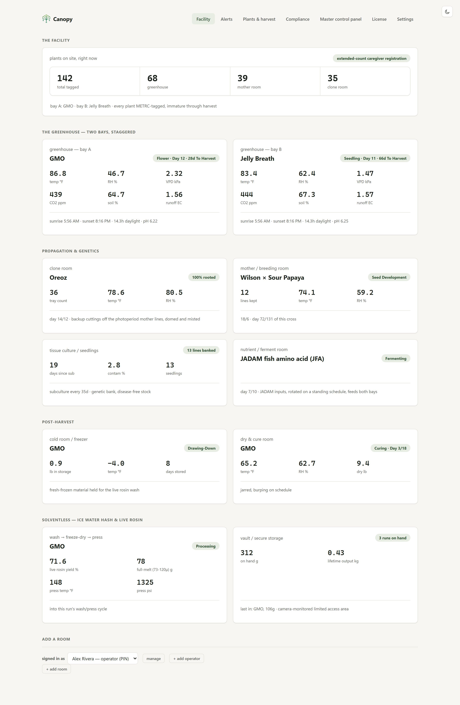
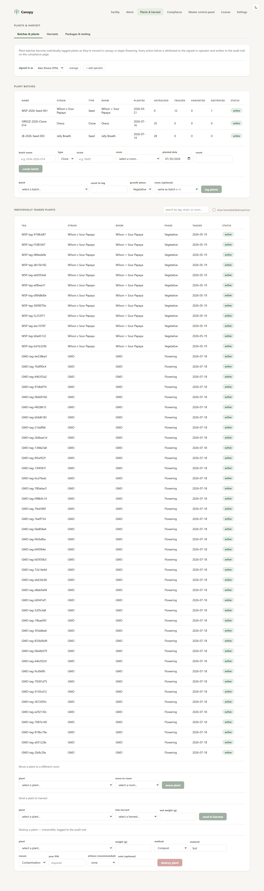
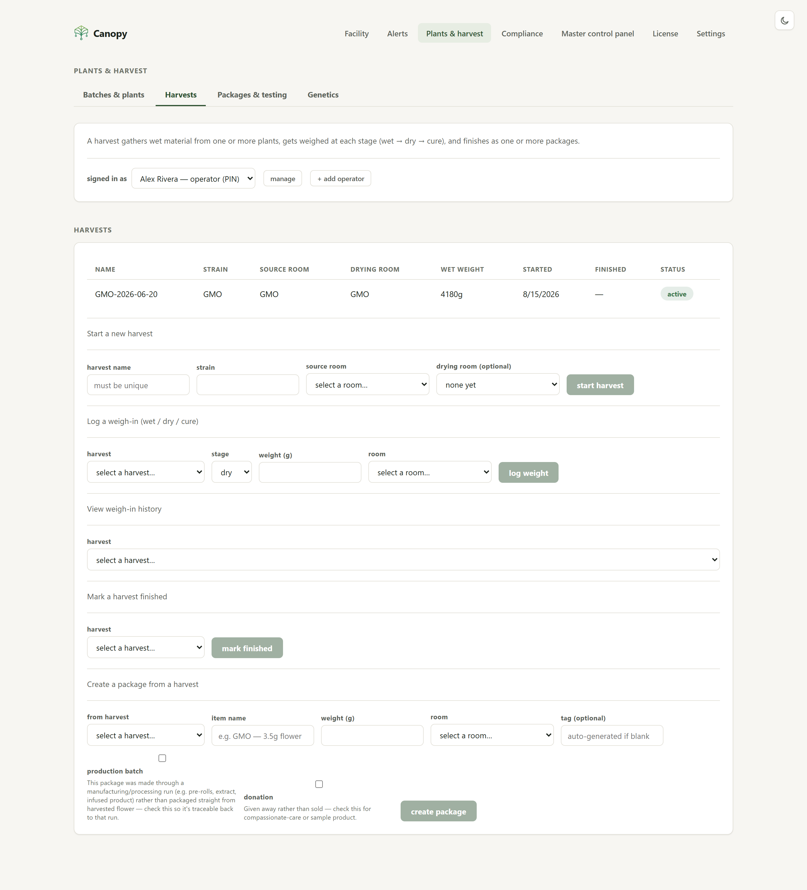
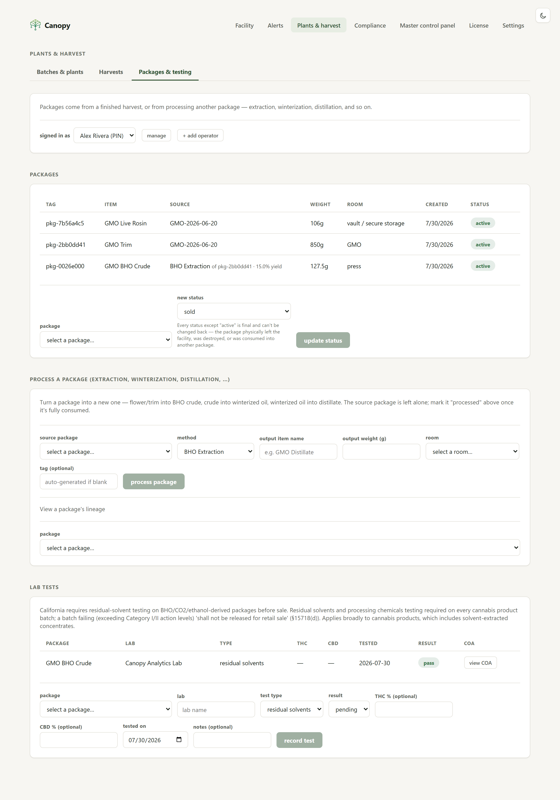
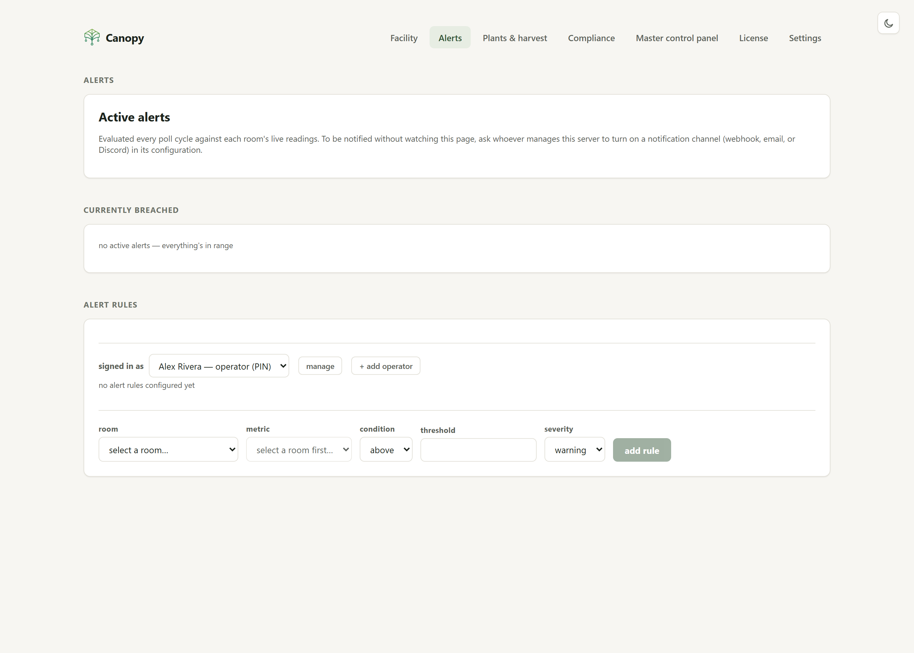
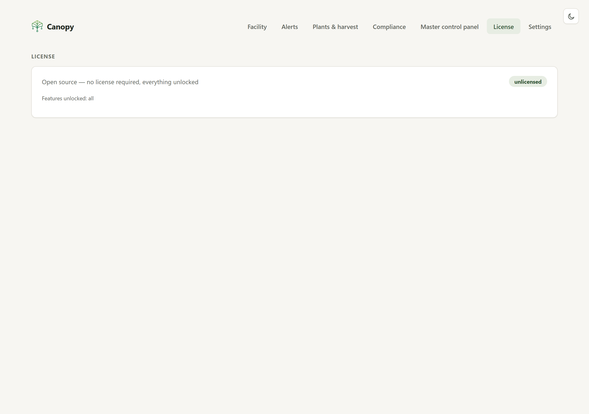
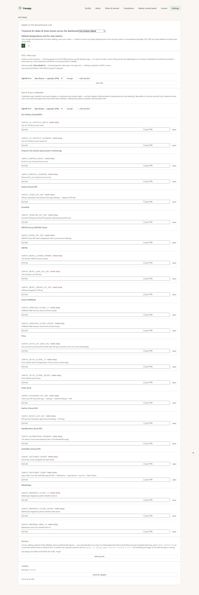

# Screenshots

← back to [README](../README.md)

Every image below is a real screenshot of Canopy's own [live demo](https://cdemo.hkdev.run) —
seeded with realistic data (`CANOPY_DEMO_MODE=true`, see `edge-agent/canopy_agent/seed_compliance.py`),
not mocked up. Click through to the demo itself to click around live.

## Facility overview

Every room on site, one card each — greenhouse bays, clone/mother rooms, dry & cure,
ice-water-hash/live-rosin processing, vault storage. Temp, RH, VPD, CO2, soil moisture,
and runoff EC are pulled from whatever sensor adapter that room is actually configured
with, not typed in by hand.

## Room detail

Click into any room for a metric picker, a sparkline chart, and the raw reading history
behind it.

## Compliance

Jurisdiction-aware cultivation and retail rules (cited to the actual regulation
section, not summarized), plant-count reconciliation, a waste/destruction log with
real reporting deadlines, and the SHA-256 hash-chained audit trail with a
"chain intact" verifier.

## Plants & harvest — batches and tagged plants

Plants start as an untagged, count-based batch and become individually METRC-style
tagged plants as they move to canopy — the same lifecycle real track-and-trace systems
use.

## Harvests

A harvest gathers wet material from one or more plants, gets weighed at each stage,
and finishes as one or more packages.

## Packages & lab tests

Packages can be processed into new packages (extraction, winterization, distillation),
with full lineage tracking. Solvent-extracted packages stay flagged until a real,
attached certificate of analysis shows a passing result for that exact batch.

## Alerts

Threshold rules per room and metric, evaluated every poll cycle, with an optional
webhook/email/Discord notification channel — see [discord-alerts.md](discord-alerts.md).

## License

Nothing is gated in the open-source build. See
[licensing-design.md](licensing-design.md) for how the corporate tier is designed to
work once it exists as a separate package.

## Settings

Per-device timezone/unit preferences, plus manual and automatic rotating backups with
a documented restore path. The Updates card at the bottom shows the exact commit this
install is running and checks GitHub for how far behind `main` it is, on demand.

## Master control panel

A single-Pi facility isn't part of a multi-site setup, so this page explains that
plainly instead of surfacing a raw API error — see "Which setup do I need?" in the
[README](../README.md#which-setup-do-i-need).
